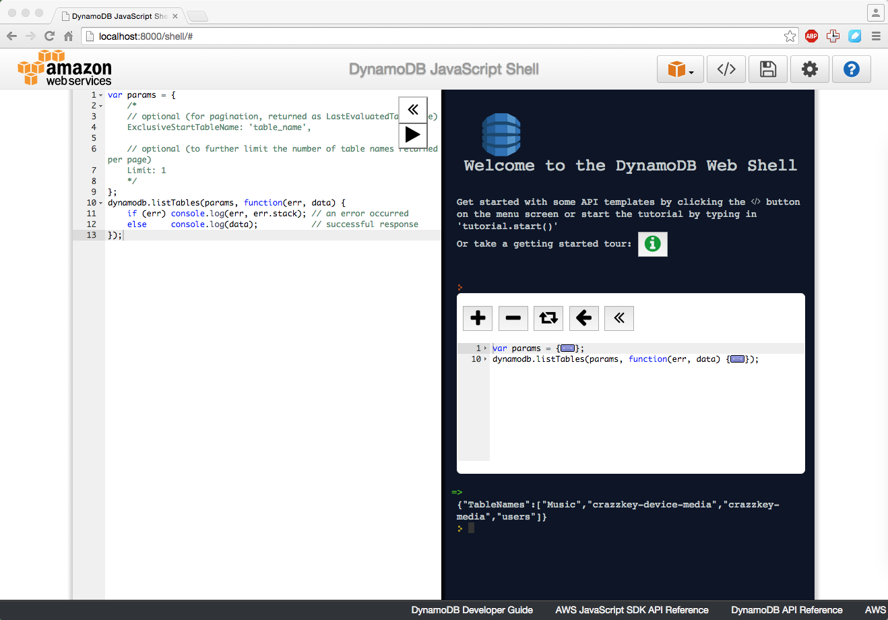

Title: 使用 Python 操作亚马逊 DynamoDB
Date: 2015-08-20 20:20
Modified: 2015-08-21 20:20
Category: Python
Tags: dynamodb, aws
Slug: python-operate-dynamodb
Authors: Martin
Summary: 使用 Python 操作亚马逊 DynamoDB

DynamoDB 是亚马逊AWS提供的一种完全托管的NoSQL数据库，省去部署/监控/维护数据库环节，给开发者节约了大量时间。 而且亚马逊提供了一个本地模拟环境用于测试和开发，我们可以使用本地的DynamoDB.local来学习和熟悉DynamoDB的API。

下载DynamoDB.local
------------------

从亚马逊的官方文档可以找到[下载地址](http://docs.aws.amazon.com/zh_cn/amazondynamodb/latest/developerguide/Tools.DynamoDBLocal.html)

解压之后:

    dynamodb_local_2015-07-16_1.0$java -Djava.library.path=./DynamoDBLocal_lib -jar DynamoDBLocal.jar -sharedDb
    Initializing DynamoDB Local with the following configuration:
    Port:   8000
    InMemory:   false
    DbPath: null
    SharedDb:   true
    shouldDelayTransientStatuses:   false
    CorsParams: *

在浏览器中打开http://localhost:8000/shell/，你会看到DynamoDB javascript shell，在网页上你可以试试javascript API的用法。

Boto3
-----

在试用之后javascript API之后，你是不是很想念我们简洁的Python呢，接下来我们就来介绍Python的用法。

官方推荐的Pyhton SDK为Boto3，我们直接进入正题:

    from boto3.session import Session

    session = Session(aws_access_key_id='anything',
                      aws_secret_access_key='anything',
                      region_name='us-east-1')

    # 指定本地的endpoint就可以使用DynamoDB.local
    client = session.client('dynamodb', endpoint_url='http://localhost:8000')
    dynamodb = session.resource('dynamodb', endpoint_url='http://localhost:8000')

    # 创建表
    user = dynamodb.create_table(
        TableName='users',
        KeySchema=[
            {'AttributeName': 'username',
            'KeyType': 'HASH'},
            {'AttributeName': 'last_name',
            'KeyType': 'RANGE'}],
        AttributeDefinitions=[
            {'AttributeName': 'username',
            'AttributeType': 'S'},
            {'AttributeName': 'last_name',
            'AttributeType': 'S'},],
        ProvisionedThroughput={
            'ReadCapacityUnits': 5,
            'WriteCapacityUnits': 5}
    )

    # 使用已经存在的表
    user = dynamodb.Table('users')

    # 增加一条记录
    user.put_item(Item={'username':'janedoe', 'first_name': 'Jane', 'last_name':'Doe', 'age':25})
    # 通过Key查询
    item = user.get_item(Key={'username':'janedoe', 'last_name': 'Doe'}).get('Item')
    # update 一条记录
    item['age'] = 30
    user.put_item(Item=item)
    # 删除一条记录
    user.delete_item(Key={'username':'janedoe', 'last_name': 'Doe'})

    # query
    from boto3.dynamodb.conditions import Key, Attr
    user.query(KeyConditionExpression=Key('username').eq('janedoe'))

    # scan
    user.scan(FilterExpression=Attr('age').gt(20))
    # query和scan的区别就是，query的查询条件必须要有Key的条件，scan不用。

    # 列出有哪些表
    client.list_tables()

我们有两种操作Dynamodb的方法，一种是使用Resource，另一种是使用client。

1.  Resources: a high level, object oriented interface
2.  Clients: low level service connections

使用Resource更加方便一些，给出的代码中就是Resource的用法。

其他资源
--------

boto3 <https://boto3.readthedocs.org/en/latest/index.html>

DynamoDB <http://docs.aws.amazon.com/amazondynamodb/latest/developerguide/Introduction.html>