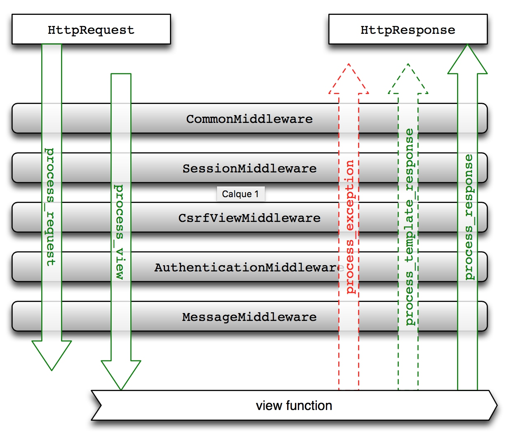

Title: django forms tips
Date: 2016-09-19 20:20
Modified: 2016-09-19 20:20
Category: Django
Tags: django
Slug: django-forms-tips
Authors: Martin
Summary: django forms tips

## django forms
djang forms 是django非常有用的功能之一，展示表单和接收表单数据非常方便。

### css class
比如下面的代码:

```
n_tz = forms.ChoiceField(choices=TIMEZONE_CHOICE, initial=8, required=True, widget=forms.Select(attrs={"class": "form-control", "id": 'n_tz'}))
```

实现了两个常用的功能
- 指定css class 和 id
- initial 初始值

### 动态改变表单验证逻辑
我们经常有这样的需求，field b不是必填项，field c也不是必填项，但是如果b不为空，c也需要不为空。我们可以定义一个 clean_c 的函数(*函数名为clean_<fieldname>*)来实现这个功能，也可以定义clean函数。
```
class DemoForm(forms.Form):
    a = forms.CharField(required=True)
    b = forms.CharField(required=False)
    c = forms.CharField(required=False)
    
    def clean_c(self):
        b = self.cleaned_data['b']
        c = self.cleaned_data['c']
        if b is not None and c is None:
            raise forms.ValidationError("c不能为空")
        
        return c
        
    def clean(self):
        cleaned_data = super(DemoForm, self).clean()
        b = cleaned_data['b']
        c = cleaned_data['c']
        if b is not None and c is None:
            raise forms.ValidationError("c不能为空")
        return cleaned_data
```

如果是比较简单的逻辑，可以在valid之前直接修改form的属性
```
form.fields['a'].required = False  # 改变required
form.is_valid()
```
### form提示错误
经常用到的一个功能是提示用户输入的有哪些错误，django的form提供了这样的功能，在template中可以用`form.fieldname.erros`,`form.fieldname.erros.as_text`
表示。

最近碰到一个很奇怪问题，给一个field initial 值之后，在template中可以展示，然后POST也能接到这个值，但是再次在template中展示却取不到这个值。只能用一个土办法绕过这个问题。

```
form = DemoForm(request.POST)
if form.is_valid():
    save()
    return redirect
else:
    new_form = DemoForm(initial=cif.cleaned_data)
    new_form._errors = form._errors
    return render('demo.html',  {"form": new_form})
```

### 使用decrator做权限检查

比如某几个view需要特定的权限才能查看，在每个view中写判断的逻辑有点冗余，这时候我们可以使用装饰器`@check_perm('foo')`，代码如下，检查权限的代码需要根据具体情况修改。

```
def check_perm(perm_name):
    def handle_func(func):
        def handle_args(request, *args, **kwargs):
            user = request.siteuser
            try:
                uperm = UserPermission.objects.get(user=user)
                if uperm.has_module_perms(perm_name):
                    return func(request, *args, **kwargs)
                else:
                    raise PermissionDenied
            except UserPermission.DoesNotExist:
                raise PermissionDenied

            except TypeError:
                raise PermissionDenied

        return handle_args
    return handle_func
```

### 自定义400，403，404，500页面

如果要自定义错误页面，需要在 urls.py 中指定error handler。

```
handler403 = 'mysite.views.my_permission_denied'
```

Exception | Handler
---|---
SuspiciousOperationsd | handler400
PermissionDenied | handler403
Http404 | handler404
其他Exception | handler500


## django middleware

### 1.9 以前的old middleware 


定义一个middleware很容易，你只需要定义一个普通的python类，然后实现如下四个方法中的某一个或者某几个，添加到`setting.py MIDDLEWARE_CLASSES` 当中:
```
process_request(request)
process_view(request, view_func, view_args, view_kwargs)
process_template_response(request, response)
process_response(request, response)
```


参考：
https://docs.djangoproject.com/en/1.10/ref/urls/
http://lukejin.iteye.com/blog/599783
https://docs.djangoproject.com/en/1.9/topics/http/middleware/

