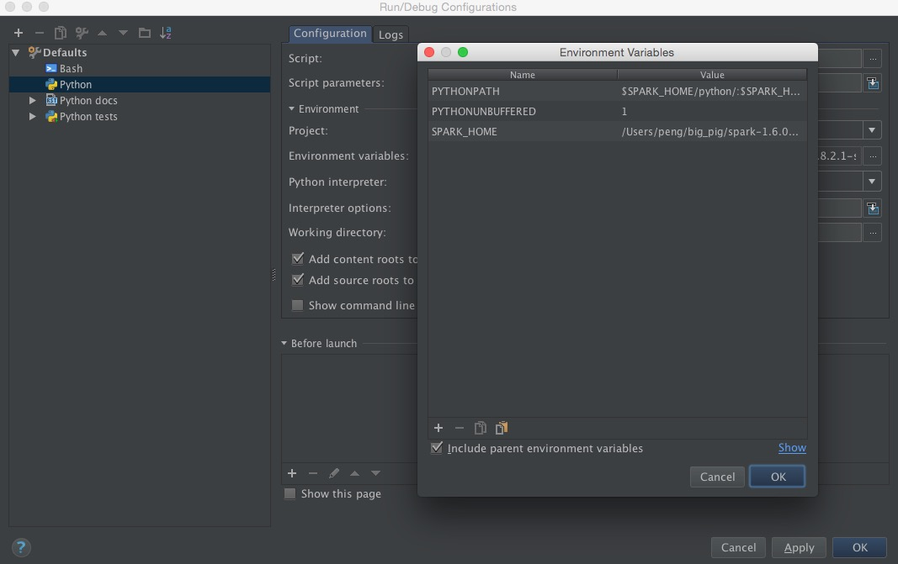

Title: 导入 pyspark 到 shell 和 pycharm当中
Date: 2016-01-19 20:20
Modified: 2016-01-19 20:20
Category: Python
Tags: pyspark, pycharm
Slug: pyspark-pycharm
Authors: Martin
Summary: 导入pyspark 到 shell 和 pycharm当中

shell
-----

在.bashrc(bash shell) 或者 .zshrc(zshell) 中增加环境变量,具体路径注意自己修改:

    export SPARK_HOME="$HOME/spark/spark-1.6.0-bin-hadoop2.6"
    export PYTHONPATH="$SPARK_HOME/python/:$SPARK_HOME/python/lib/py4j-0.9-src.zip:$PYTHONPATH"

然后在python console 可以 import pyspark

pycharm
-------

在PyCharm的menu中找到Run -- Edit Configurations

在Defaults当中找到python, 点击Environment, 增加两行环境变量:

    SPARK_HOME="$HOME/spark/spark-1.6.0-bin-hadoop2.6"
    PYTHONPATH="$SPARK_HOME/python/:$SPARK_HOME/python/lib/py4j-0.9-src.zip:$PYTHONPATH"

重启PyCharm应该就不会看到红色波浪线了.