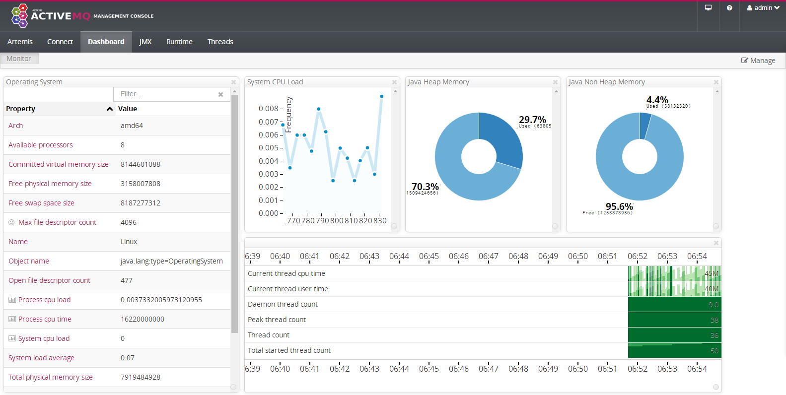

Title: ActiveMQ Artemis 的安装和使用
Date: 2019-07-02 16:14
Modified: 2019-07-02 16:14
Category: Java
Tags: java, activemq, artemis, spring, jms
Slug: activemq-artemis-install
Authors: Martin
Summary: ActiveMQ Artemis 是 ActiveMQ 5 的继任者，在 JBoss 捐赠的 HornetQ 基础上继续开发而来，支持大量的新特性，支持 JMS 2.0， MQTT， STOMP 等等


## ActiveMQ Artemis 的安装

下载 [安装包](http://activemq.apache.org/components/artemis/download/) ，然后解压

```bash
export ARTEMIS_HOME=${HOME}/apache-artemis-2.9.0
${ARTEMIS_HOME}/bin/artemis create eventbroker --http-host 10.80.28.27
```

创建 Broker Instance

```
[demo@localhost ~]$ ${ARTEMIS_HOME}/bin/artemis create eventbroker --http-host 10.80.28.27
Creating ActiveMQ Artemis instance at: /home/demo/eventbroker

--user: is a mandatory property!
Please provide the default username:
admin

--password: is mandatory with this configuration:
Please provide the default password:


--allow-anonymous | --require-login: is a mandatory property!
Allow anonymous access?, valid values are Y,N,True,False
Y

Auto tuning journal ...
done! Your system can make 7.58 writes per millisecond, your journal-buffer-timeout will be 132000

You can now start the broker by executing:  

   "/home/demo/eventbroker/bin/artemis" run

Or you can run the broker in the background using:

   "/home/demo/eventbroker/bin/artemis-service" start
```

## 启动和停止

ActiveMQ Artemis 只支持 Java 7 及以上

```bash
# service
"/home/demo/eventbroker/bin/artemis-service" start
"/home/demo/eventbroker/bin/artemis-service" stop

# run in shell
"/home/demo/eventbroker/bin/artemis" run
```

## 修改 JVM 参数

在`/home/demo/eventbroker/bin/artemis`文件的最后有 Java 启动的时候的参数，如果需要修改 JVM 参数可以在这里修改

```
    -Xms2048M \
    -Xmx2048M \
    -XX:MaxMetaspaceSize=512M \
    -XX:MetaspaceSize=512M \
```

## Web Console

启动 ActiveMQ Artemis 之后，访问 `http://localhost:8161/console`，使用之前创建 Broker Instance 里设置的用户名密码登录



## 配置 broker.xml

编辑`/home/demo/eventbroker/etc/broker.xml`

1. 禁用掉自动创建 address
```xml
            <!-- 在 address-setting 部分 -->
            <auto-create-queues>false</auto-create-queues>
            <auto-create-addresses>true</auto-create-addresses>
            <!-- <auto-create-jms-queues>true</auto-create-jms-queues> -->
            <!-- <auto-create-jms-topics>true</auto-create-jms-topics> -->
```

2. 配置 topic

自动创建的 queue 默认是 durable 的

```xml
<addresses>
   <address name="pubsub.foo">
      <multicast>
      </multicast>
   </address>
</addresses>
```

## Spring JMS 的设置

Spring 的 JMS 配置和其他的一样，并没有什么不同

```xml
    <bean id="connectionFactory" class="org.apache.activemq.artemis.jms.client.ActiveMQJMSConnectionFactory">
        <constructor-arg value="tcp://10.80.28.27:61616"/>
    </bean>

    <bean id="exampleQueue" class="org.apache.activemq.artemis.jms.client.ActiveMQQueue">
        <constructor-arg index="0" value="exampleQueue"/>
    </bean>

    <bean id="exampleTopic" class="org.apache.activemq.artemis.jms.client.ActiveMQTopic">
        <constructor-arg index="0" value="exampleTopic"/>
    </bean>

    <bean id="jmsTemplate" class="org.springframework.jms.core.JmsTemplate">
        <property name="connectionFactory" ref="connectionFactory" />
    </bean>
    
    <bean id="sampleJmsMessageSender" class="com.example.SampleJmsMessageSender">
        <property name="jmsTemplate" ref="jmsTemplate"/>
        <property name="queue" ref="exampleQueue"/>
        <property name="topic" ref="exampleTopic"/>
    </bean>

    <bean id="messageListener" class="com.example.SampleListener">
    </bean>

    <bean id="jmsContainer" class="org.springframework.jms.listener.DefaultMessageListenerContainer">
        <property name="connectionFactory" ref="connectionFactory"/>
        <property name="destination" ref="exampleTopic"/>
        <property name="messageListener" ref="messageListener"/>
    </bean>
```

```java
package com.example;

import org.springframework.jms.core.JmsTemplate;

import javax.jms.Queue;
import javax.jms.Topic;

public class SampleJmsMessageSender {

    private JmsTemplate jmsTemplate;
    private Queue queue;
    private Topic topic;

    public void simpleQueueSend() {
        jmsTemplate.send(queue, s -> s.createTextMessage("hello queue world"));
    }

    public void simpleTopicSend() {
        jmsTemplate.send(topic, s -> s.createTextMessage("hello topic world"));
    }


    public JmsTemplate getJmsTemplate() {
        return jmsTemplate;
    }

    public void setJmsTemplate(JmsTemplate jmsTemplate) {
        this.jmsTemplate = jmsTemplate;
    }

    public Queue getQueue() {
        return queue;
    }

    public void setQueue(Queue queue) {
        this.queue = queue;
    }

    public Topic getTopic() {
        return topic;
    }

    public void setTopic(Topic topic) {
        this.topic = topic;
    }
}
```

```java
package com.example;

import javax.jms.JMSException;
import javax.jms.Message;
import javax.jms.MessageListener;
import javax.jms.TextMessage;

public class SampleListener implements MessageListener {
    @Override
    public void onMessage(Message message) {
        if (message instanceof TextMessage) {
            try {
                String msg = ((TextMessage) message).getText();
                System.out.println("Message has been consumed : " + msg);
            } catch (JMSException ex) {
                throw new RuntimeException(ex);
            }
        } else {
            throw new IllegalArgumentException("Message Error");
        }
    }
}
```


## JMS 中设置持久化订阅

持久化订阅需要设置 ClientID 和 SubscriptionName 来唯一标识一个 Consumer，也就说如果有两个 Connection 这两项一致，ActiveMQ 就认为这两个 Consumer 是同一个

```xml
    <!-- 这里用 ActiveMQ Classic 的例子 -->
    <bean id="consumerAmqConnectionFactory" class="org.apache.activemq.ActiveMQConnectionFactory">
        <constructor-arg index="0" value="tcp://10.80.28.27:61616" />
        <property name="clientID" value="HOST-Consumer"/>
    </bean>

    <!-- ConnectionFactory Definition -->
    <bean id="consumerConnectionFactory" class="org.springframework.jms.connection.SingleConnectionFactory">
        <constructor-arg ref="consumerAmqConnectionFactory" />
    </bean>

    <bean id="consumerExampleTopic" class="org.apache.activemq.command.ActiveMQTopic">
        <constructor-arg index="0" value="exampleTopic"/>
    </bean>


    <bean id="messageListener" class="com.example.SampleListener">
    </bean>


    <!-- durable subscription need set  SubscriptionName and ClientID  to identify unique Consumer -->
    <!-- 持久化订阅 需要设置 SubscriptionName 和 ClientID 来唯一标识一个 Consumer -->
    <bean id="jmsContainer" class="org.springframework.jms.listener.DefaultMessageListenerContainer">
        <property name="connectionFactory" ref="consumerConnectionFactory"/>
        <property name="destination" ref="consumerExampleTopic"/>
        <property name="messageListener" ref="messageListener"/>
        <property name="subscriptionDurable" value="true"/>
        <property name="durableSubscriptionName" value="Subscriber-B"/>
    </bean>
```