Title: 乞丐版 nas
Status: published
Date: 2020-07-04 14:00
Modified: 2020-07-04 14:00
Category: Linux
Tags: linux, nas
Slug: begger-nas
Authors: Martin
Summary: 用树莓派3b做一个乞丐版 NAS

## 贫穷

看着群晖流口水，可惜钱包没这么鼓，但是 Mac 的硬盘又这么小，天天都要清理，电影视频都觉得是个宝贝，不想删除，实在很难受。

手头上正好有个闲置(chihui)的树莓派3b，虽然各种性能都不行，但又不是不能用，实现一个乞丐版 nas 还是很简单的。


> 树莓派3b USB 接口都是2.0，而且网口只有百兆，如果新买的话，推荐购买新出的树莓派4b，千兆网卡加上 USB 3.0

## 购物清单

为了尽可能增加存储空间，购买了一个双盘位的硬盘底座，加上两个2T的西数普通盘（由于贫穷就没有买西数红盘，价格比普通的贵了差不多40%）

1. 奥睿科(ORICO)硬盘底座USB3.0 双盘位6228US3   价格118
2. 西部数据(Western Digital)蓝盘 2TB * 2      价格359 * 2

## 软件安装

推荐安装 openmediavault 开源的 nas 系统，基于 debian，通过 web 管理，非常方便

### 安装 Raspberry Pi OS

从官网下载 SD 卡工具 https://www.raspberrypi.org/downloads/

选择不需要桌面环境的 Raspberry Pi OS (32-bit) Lite (Minimal image based on Debian Buster

如果有显示器和键盘可以看到开机过程，默认的用户名是 pi，密码是 raspberry

如果没有显示器和键盘，在写入 SD 卡镜像之前有一些配置，参考 http://sonicguo.com/2019/Initialize-RaspBerry-3-with-wifi/

### 修改源

修改下面的文件，连接国内的镜像源速度更快

/etc/apt/sources.list

```
deb http://mirrors.tuna.tsinghua.edu.cn/raspbian/raspbian/ buster main non-free contrib
deb-src http://mirrors.tuna.tsinghua.edu.cn/raspbian/raspbian/ buster main non-free contrib
```

/etc/apt/sources.list.d/raspi.list

```
deb http://mirrors.tuna.tsinghua.edu.cn/raspberrypi/ buster main ui
```

更新系统

```
sudo apt-get update
sudo apt-get upgrade
```

### 安装 openmediavault

openmediavault 官方有一个 [guide](https://forum.openmediavault.org/index.php?thread/28789-installing-omv5-on-raspberry-pi-s-armbian-sbc-s-i386-32-bit-platforms/) 

按照官方的步骤就可以了

```
sudo apt-get update
sudo apt-get upgrade -y
sudo rm -f /etc/systemd/network/99-default.link ## 一点要记得删除，否则后续网络会有问题
sudo reboot
```

在国内访问 github 会有点问题，导致下载安装脚本失败。通过修改host文件可以解决这个问题, 从这个repo https://github.com/googlehosts/hosts 找到 github 的部分。 在 `/etc/hosts` 中增加：

```
# GitHub Start
192.30.255.112	gist.github.com
192.30.255.112	github.com
192.30.255.112	www.github.com
151.101.56.133	avatars0.githubusercontent.com
151.101.56.133	avatars1.githubusercontent.com
151.101.56.133	avatars2.githubusercontent.com
151.101.56.133	avatars3.githubusercontent.com
151.101.56.133	avatars4.githubusercontent.com
151.101.56.133	avatars5.githubusercontent.com
151.101.56.133	avatars6.githubusercontent.com
151.101.56.133	avatars7.githubusercontent.com
151.101.56.133	avatars8.githubusercontent.com
151.101.56.133	camo.githubusercontent.com
151.101.56.133	cloud.githubusercontent.com
151.101.56.133	gist.githubusercontent.com
151.101.56.133	marketplace-screenshots.githubusercontent.com
151.101.56.133	raw.githubusercontent.com
151.101.56.133	repository-images.githubusercontent.com
151.101.56.133	user-images.githubusercontent.com
# GitHub End
```

执行安装脚本，然后等着就可以了，时间会有点长。

```
wget -O - https://github.com/OpenMediaVault-Plugin-Developers/installScript/raw/master/install | sudo bash
```


### 硬盘底座的设备配置

使用硬盘底座，硬盘的序列号显示不正确，需要修改配置， 见 https://openmediavault.readthedocs.io/en/5.x/troubleshooting.html

```
# JMicron drive fix
KERNEL=="sd*", ENV{ID_VENDOR}=="JMicron", SUBSYSTEMS=="usb", PROGRAM="/root/serial.sh %k", ENV{ID_SERIAL}="USB-%c", ENV{ID_SERIAL_SHORT}="%c"
```

### 配置 samba

后面就可以全部通过网页来配置

先看 `存储器->磁盘` 能否找到我们的磁盘（如果是全新的磁盘需要先创建文件系统，容量越大耗时越长），然后去 `存储器->文件系统` 挂载文件系统

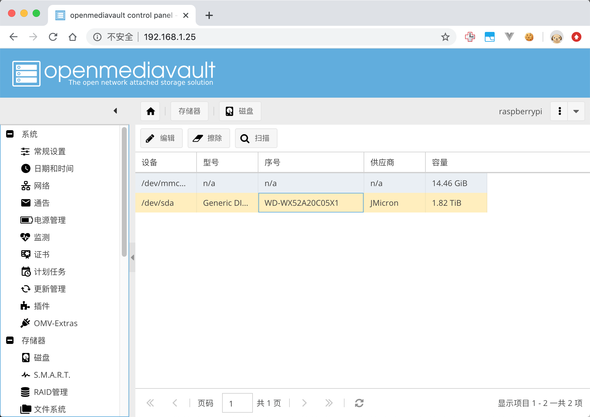

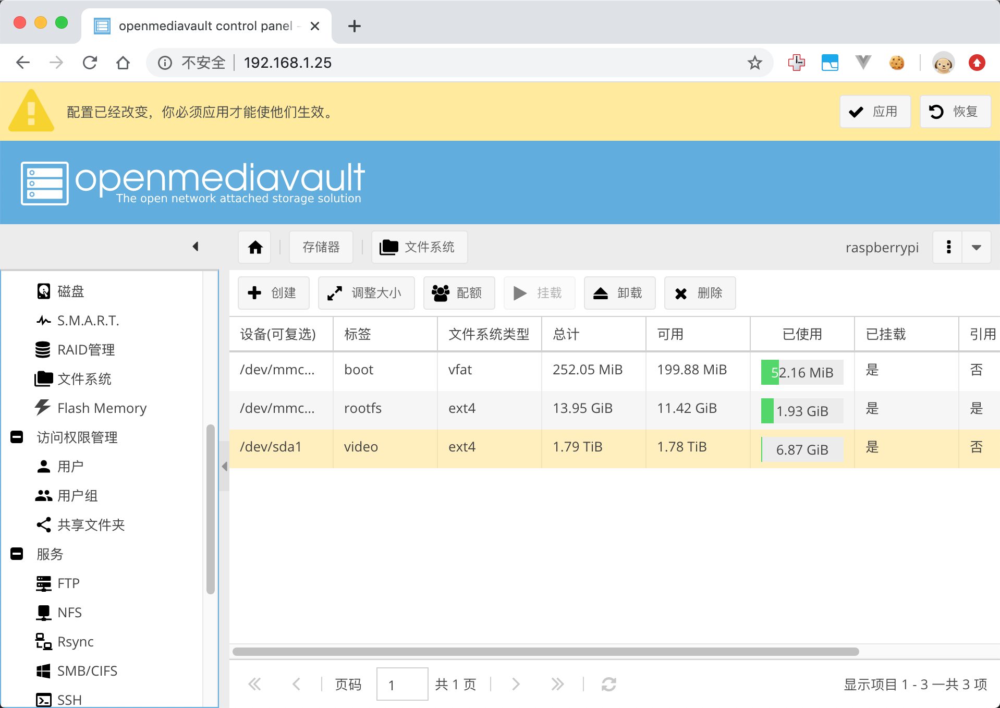

可以修改一下磁盘配置，延长磁盘寿命

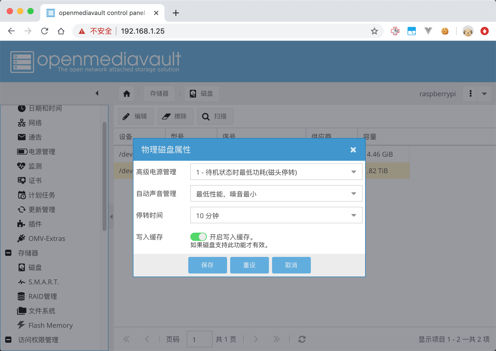

接下来就是配置 samba，先把启用钩上，然后添加共享文件夹

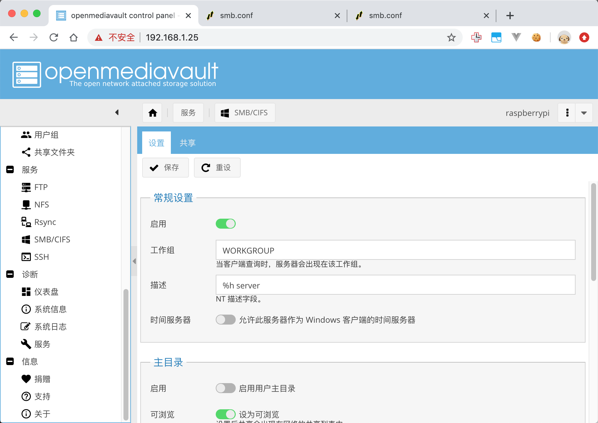

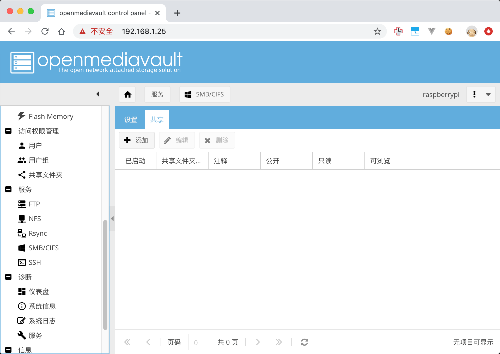

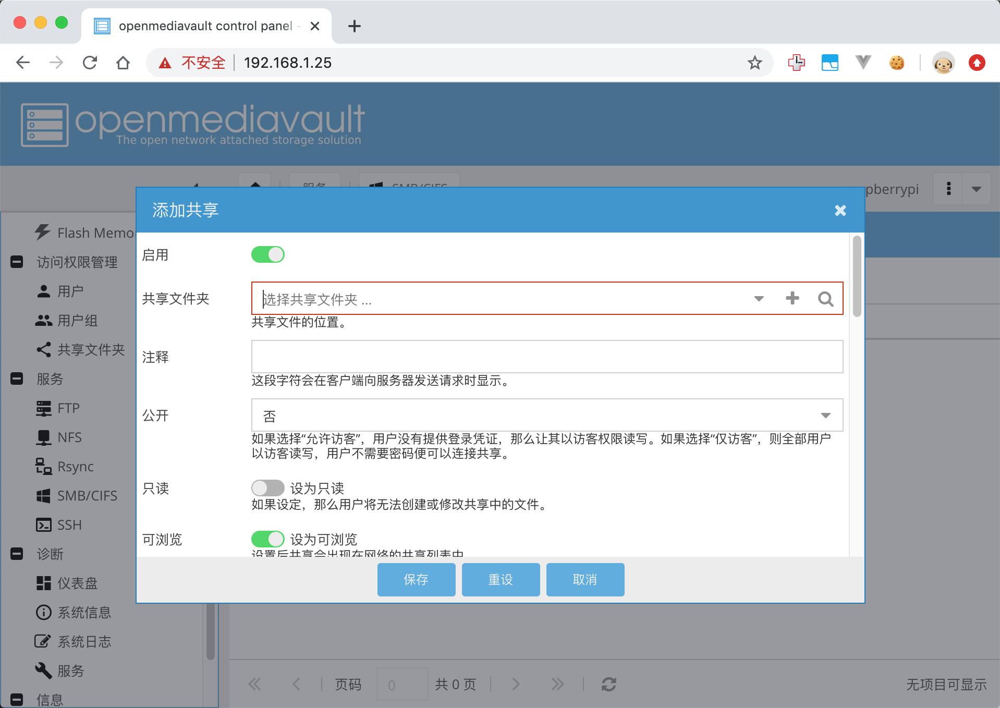

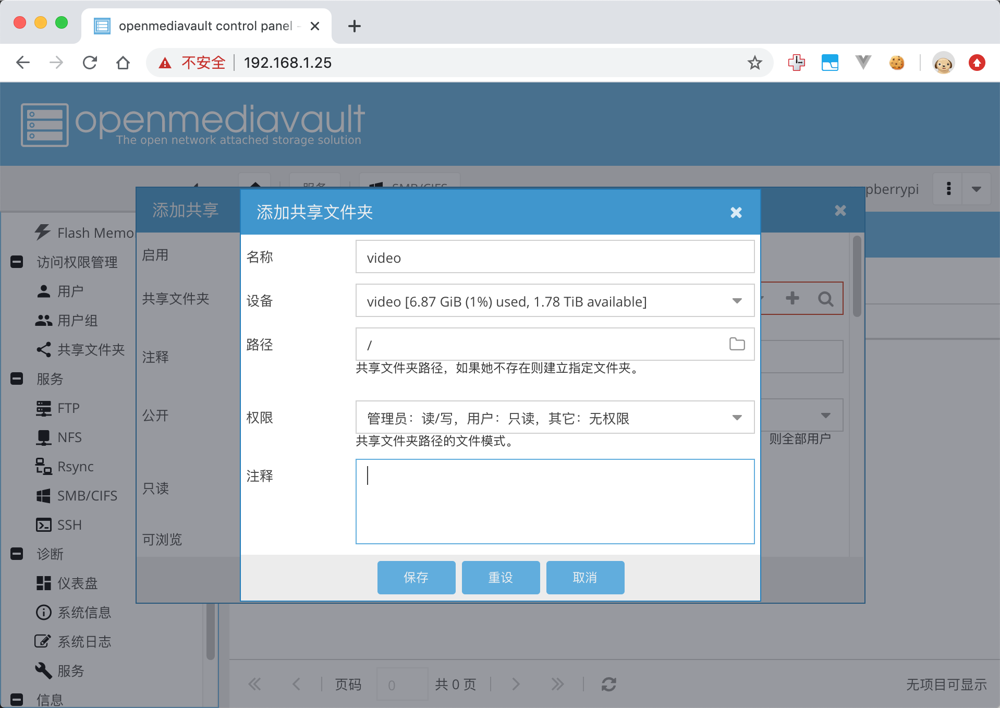

还需要配置共享文件夹的权限，让 pi 用户拥有读写权限

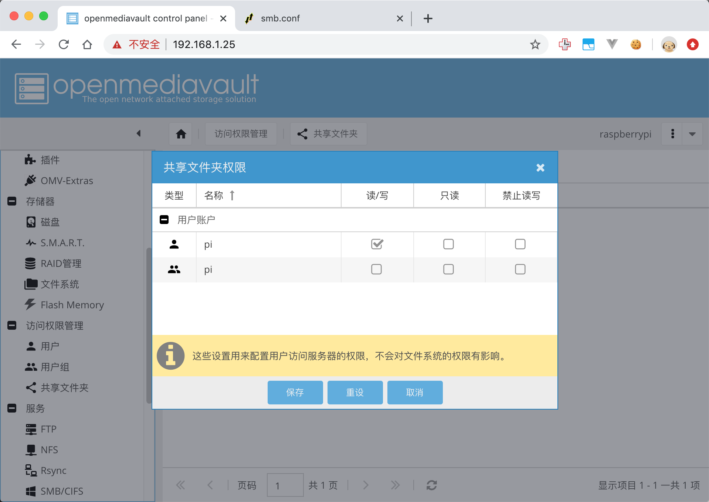

这个时候去 `Finder->前往->连接服务器` 里面连接 samba 的时候，会发现密码不正确。有一个不容易理解的地方是 samba 的密码是单独，不是系统用户的密码，如果是通过 omv 的 web 修改用户密码，omv 会帮你把系统的密码和 samba 的密码改为一致。所以去用户管理的界面修改一下密码就行。

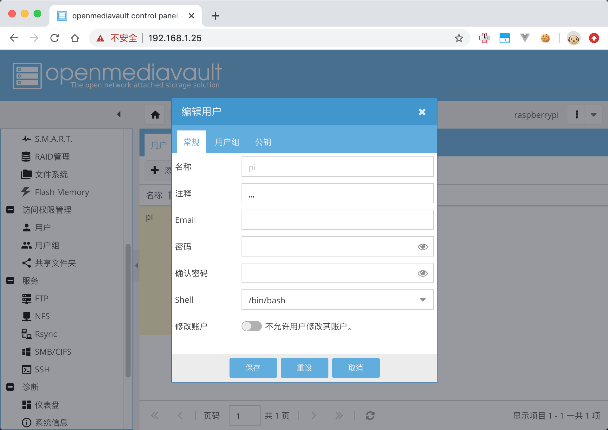

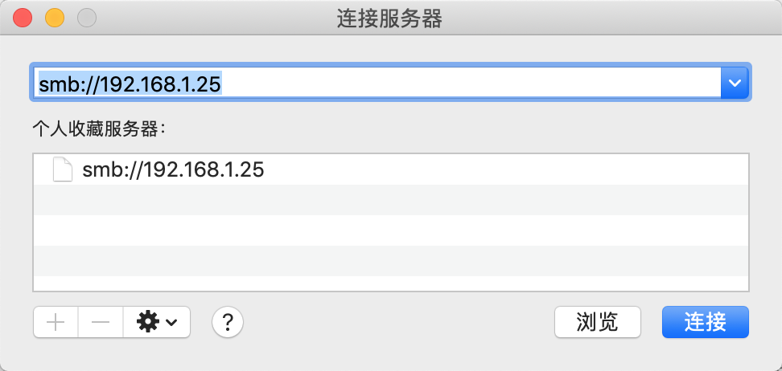

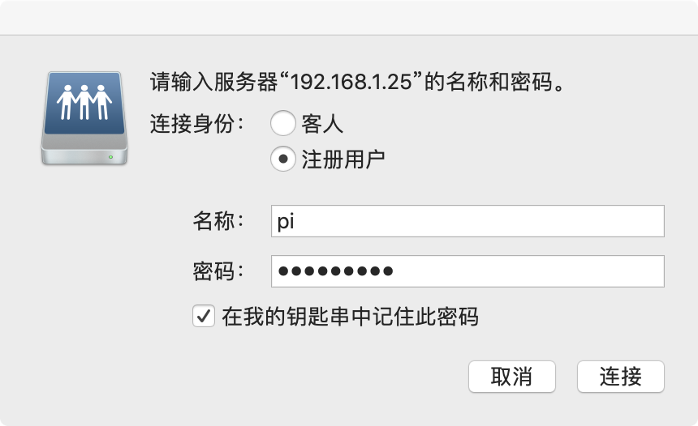

然后你就可以像访问本地磁盘一样访问树莓派挂载的硬盘了，速度受网络情况限制，尽量通过有线网络访问，无线网络的速度还是比不上网线。

## 其他需要注意的地方

1. 安装 openmediavault 之前一定要删除 /etc/systemd/network/99-default.link
2. 安装好 openmediavault 之后 wifi 会被禁用，如果你是通过 wifi ssh 连接树莓派的话，需要先把树莓派通过网线连接到路由器上。然后可以通过 `系统->网络` 再添加 wifi 接口
3. 如果树莓派开机过程进入 emegency mode，肯定是之前哪个文件修改出错，可以把 SD 卡挂载到 Linux 系统上，然后把之前修改的还原。（Mac 不支持 读写ext4文件系统，起一个 Linux 虚拟机就行了，把 USB 口分配给虚拟机，然后就可以在虚拟机内处理了）