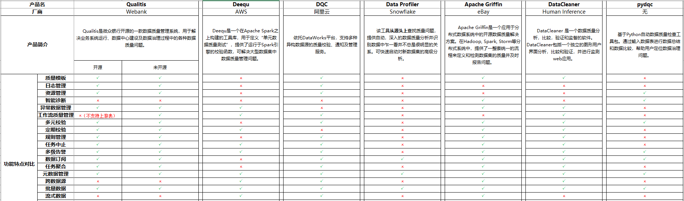

Title: Data Quality Monitor
Status: draft
Date: 2021-01-18 10:00
Modified: 2021-01-18 12:00
Category: Data
Tags: data
Slug: data-quality-monitor
Authors: Martin
Summary: 数据质量监控


## 数据质量监控

目前数据质量监控有很多开源项目，很多都是配合大数据来进行数据质量管控的




## Hadoop 安装

单机模式（Local (Standalone) Mode）：Hadoop的默认模式，0配置。Hadoop运行在一个Java进程中，使用本地文件系统，不使用HDFS，一般用于开发调试MapReduce程序的应用逻辑。

伪分布式模式（Pseudo-Distributed Mode）：需简单配置，相当于只有一个节点的集群，Hadoop的所有守护进程运行在同一台机器上。该模式在单机模式之上增加了代码调试功能，允许你检查内存使用情况，HDFS输入输出，以及其他的守护进程交互。

完全分布式模式（Fully-Distributed Mode）：根据需要进行配置。多节点，一般用于生产环境，可认为是由伪分布式模式的一个节点变为多个节点。

单机模式安装很简单，解压之后配置一下环境变量就行，[参考](https://blog.csdn.net/liuxinghao/article/details/40110679)

伪分布式安装，[参考](https://blog.csdn.net/liuxinghao/article/details/40110773)

需要编辑 `$HADOOP_HOME/etc/hadoop/core-site.xml` 和 `$HADOOP_HOME/etc/hadoop/hdfs-site.xml`

SSH 免密码登录，[参考](https://blog.csdn.net/liuxinghao/article/details/40082481)

```
cd ~/.ssh
ssh-keygen -t rsa
cp id_rsa.pub authorized_keys
chmod 600 authorized_keys
ssh-agent bash
ssh-add
```

[如何修改hostname](https://www.cnblogs.com/zhaojiedi1992/p/zhaojiedi_linux_043_hostname.html)

## hive 安装

https://blog.csdn.net/Kohang/article/details/79048931

需要编辑 `conf/hive-env.sh` `conf/hive-site.xml`

## spark 安装

下载 spark-2.4.7-bin-without-hadoop-scala-2.12

## DSS

注意：安装的服务器内存至少需要10G以上，否则一些服务会出现启动失败


