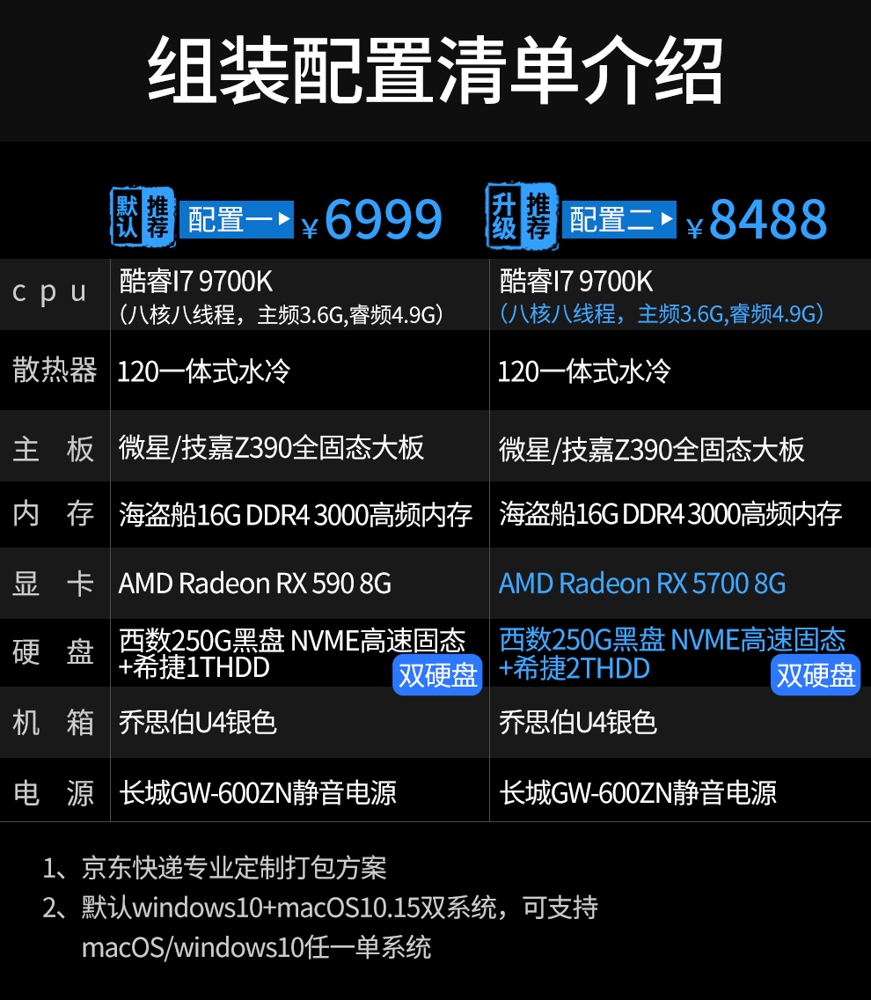

Title: 黑苹果幻想
Status: published
Date: 2020-07-18 14:00
Modified: 2020-07-18 14:00
Category: Hardware
Tags: mac, hackintosh
Slug: hackintosh-dream
Authors: Martin
Summary: 这几天想着组一台黑苹果

## 黑苹果

自从 Mac 采用 Intel CPU 之后，黑苹果就成为一种可能，而且近年来越来越成熟。

[Hackintosh](https://github.com/daliansky/Hackintosh) 国内论坛维护的安装黑苹果的教程和各种硬件配置

我自己也看了看各种配置，算起来，组一个性能跟得上时代的黑苹果价格大概在6000左右，和淘宝上买装机店组装好的黑苹果价格其实差不多。

2020-07-18的价格

1. AMD Ryzen R3600   1369元
2. 微星（MSI）B450M MORTAR MAX迫击炮 739元（粉丝价：649，秒杀价：599）
3. 迪兰（Dataland）RX 590 8G X战神 PLUS 1545/8Gbps 8GB/256-bit GDDR5 DX12 游戏显卡 1199元
4. 金士顿(Kingston) DDR4 2666 16GB 台式机内存条 399元X2
5. 西部数据（Western Digital）1TB SSD固态硬盘 M.2接口（NVMe协议）WD Blue SN550 889元（PLUS会员价：859）
6. 先马（SAMA）平头哥M1电竞版 Mini小机箱 支持MATX主板240水冷/非钻孔钢化玻璃侧透/背线/独立电源仓/U3 179元（秒杀价：148）
7. 安钛克(Antec)HCG650金牌全模/10年换新/ 全日系电容/台式机电脑主机机箱电源650W（14cm短机身/智能温控） 699元

总价 5671元，再加上一些鼠标键盘之类的，估计就上 6000 了

也看了看装机店的黑苹果，都是 Intel CPU + AMD 显卡，价格其实也不太贵，就是具体配件的型号不知道，不知道具体的价格，价格其实和自己组贵不了几百块。店家帮你装好也省得自己折腾了，节省时间精力也是省钱哈。

## 未来

下一代 Mac 苹果转向了 arm64 的架构，和 iphone ipad 相同的硬件架构，节省以后软件的维护和开发的资源。不过 x86_64 在服务器端的优势目前还看不到任何挑战，对程序员而言，x86_64 应该还是开发主力架构，如果苹果完全放弃 x86_64，arm64 架构的 Macbook pro 可能不再会作为程序员的主力机型，不过目前不用担心，至少5年之后才知道是否会彻底放弃 x86_64。

未来打算自己组一个黑苹果和 Linux 都支持的主机，显卡必须用 AMD，CPU 用 Intel 兼容性好一些，预算在 1W 左右，还是努力挣钱吧。

