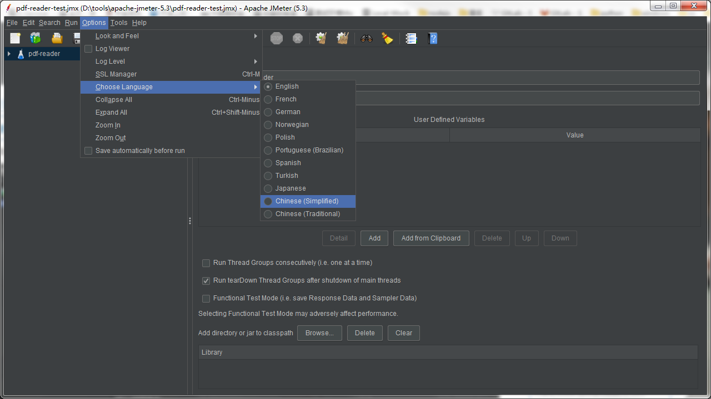
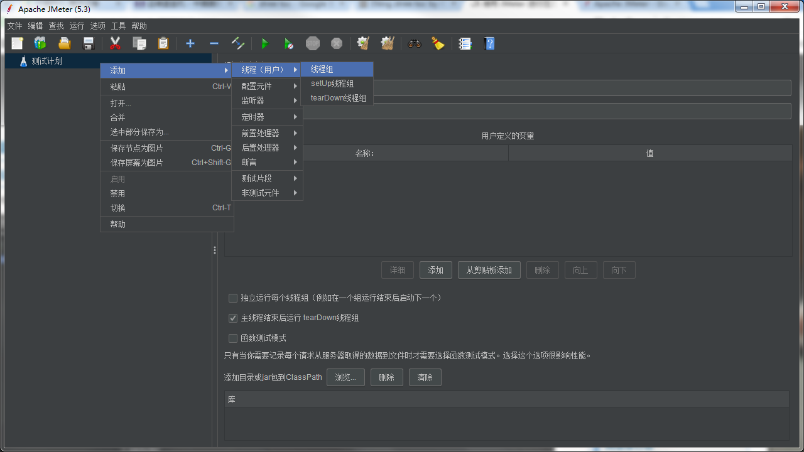
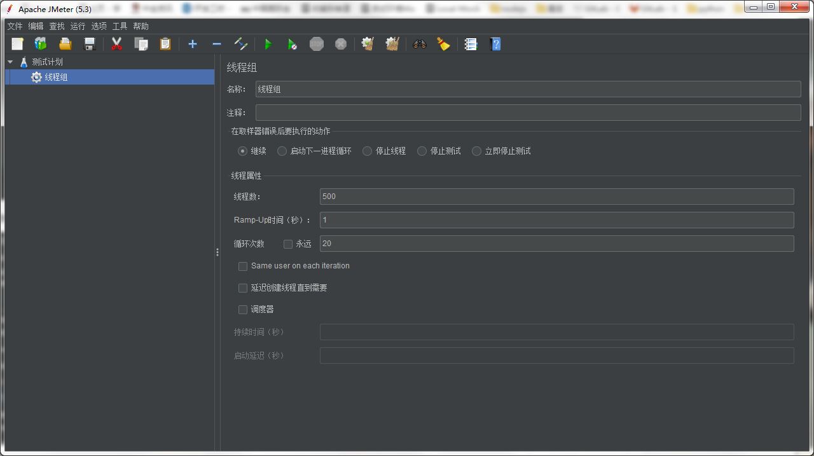
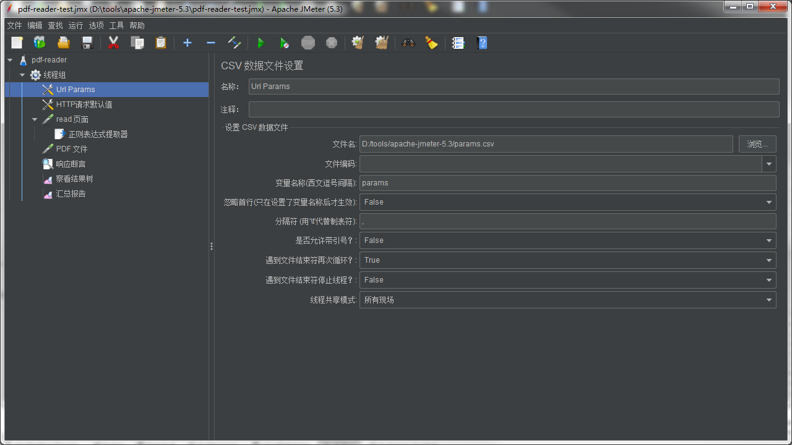
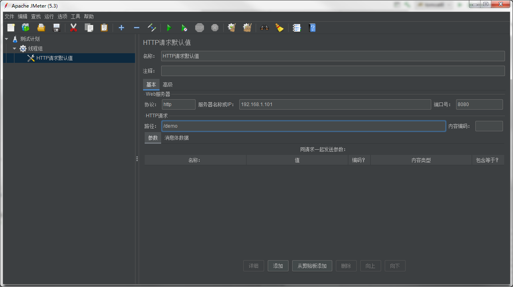
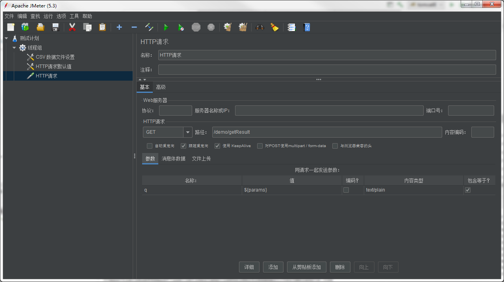
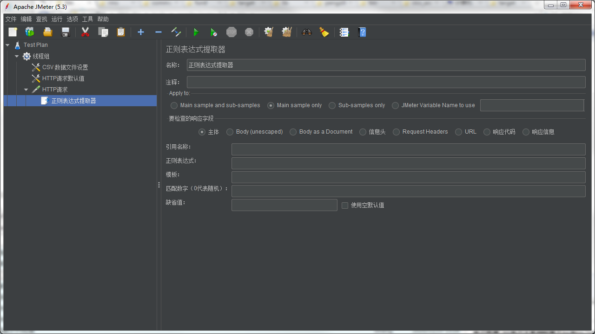
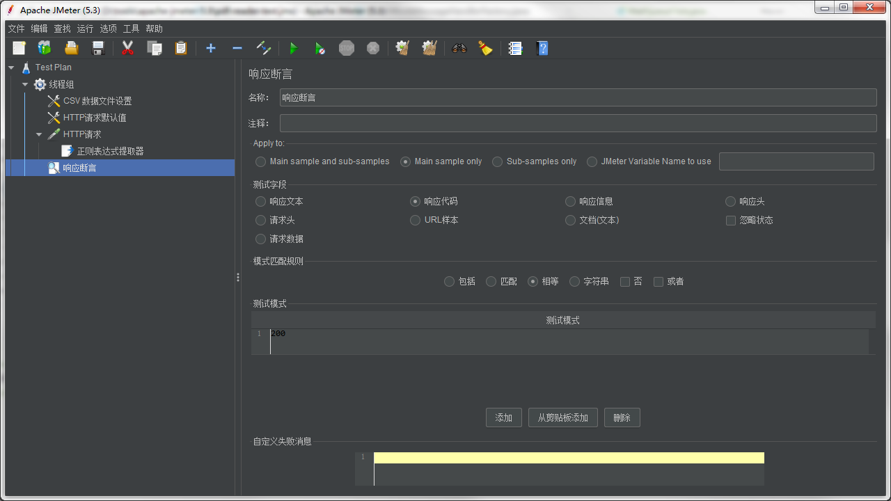
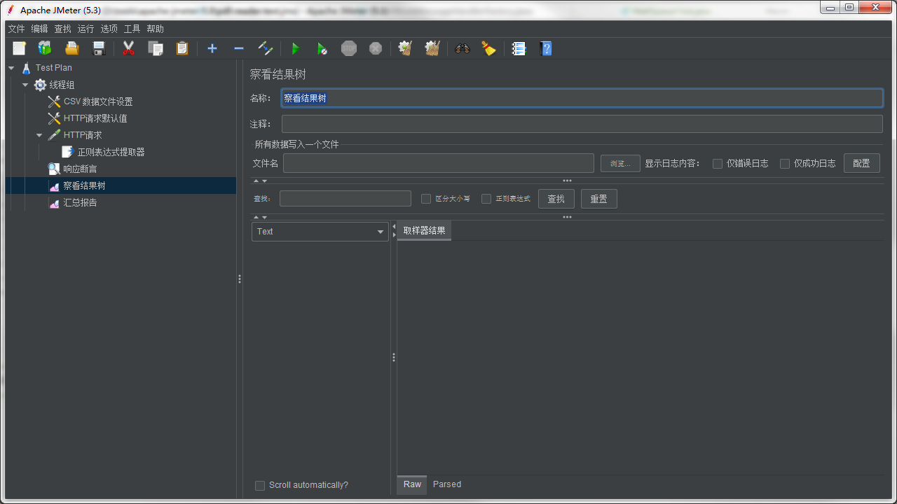
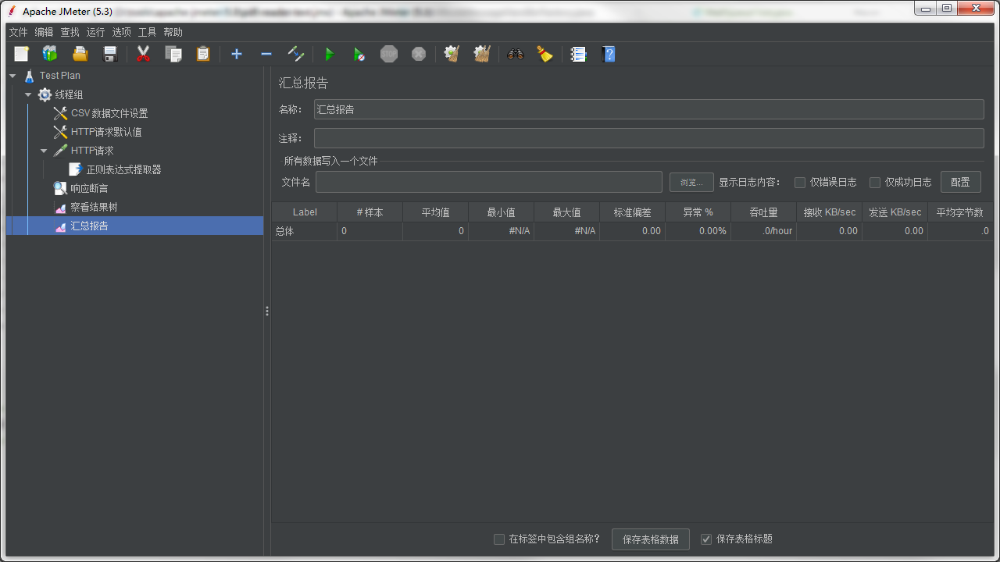

Title: Apache JMeter 压力测试
Status: published
Date: 2020-11-05 11:00
Modified: 2020-11-05 12:00
Category: Java
Tags: jmeter, testcase
Slug: jmeter-stress-test
Authors: Martin
Summary: Apache JMeter 压力测试


## 压力测试

压力测试是对系统不断施加压力，来获得系统最大服务能力的测试。参考[压力测试](https://testerhome.com/articles/20911)

比如可以用 50/100/200 并发之下服务器的响应时间和是否能发生异常，来判断系统正常可以处理多少并发。

目的：
1. 当负载逐渐增加时，观察系统各项性能指标的变化情况是否有异常 
2. 发现系统的性能短板，进行针对性的性能优化
（如：使用mysql存储的系统，高并发情况下，数据库读写速度慢，可以考虑增加数据库中间件，加缓存等；使用redis存储的系统，通常存储不会制约性能，但在高并发情况下，Redis的吞吐量非常大，这时候就需要考虑增加网络带宽来提高性能。） 
3. 系统在高并发情况下是否会报错，进程是否会挂掉 
4. 测试在系统某个方面达到瓶颈时，系统可以支持的最大负载


https://www.cnblogs.com/stulzq/p/8971531.html


### 下载 Apache JMeter

[Apache JMeter 下载](http://jmeter.apache.org/download_jmeter.cgi)

解压 apache-jmeter-5.3.zip, 进入 bin 目录， 使用 jmeterw.cmd 打开配置的 GUI 界面

如果要运行压力测试，需要通过命令行启动 `jmeter.bat`


### Apache JMeter 配置

下面配置一个从CSV文件中读取测试数据，拼URL，然后压测的例子。

很多情况下系统是有缓存的，如果重复访问同一URL，第二次就会从缓存中取数据，导致压力测试的数据不准，每次访问不同的URL更能模拟真实的情况。

官方提供了简体中文，通过 Options -> Choose Language 可选择简体中文。



1. 添加线程组



设置线程数, 循环次数, Same user on each iteration



2. 添加配置元件

配置元件 -> CSV Data Set Config



最重要的是“设置变量名称”， 可以在后面的配置里直接引用这个变量

配置元件 -> HTTP请求默认值




3. 添加取样器

取样器 -> HTTP 请求



如果有复杂的逻辑，比如先去一个页面查询，需要带上这个页面里的一些数据再去第二次请求，这个时候可以用`正则表达式提取器`。在这个‘HTTP 请求’上右键，添加 后置处理器 -> 正则表达式提取器



引用名称：后面用到的变量名

正则表达式：正则表达式需要用到 group

模板：$i$ 表示取第i个group

匹配数字(0表示随机)：表示取第几次匹配的结果

4. 添加断言

断言 -> 响应断言



检查 http status code 是否等于 200

5. 添加结果汇总

监听器 -> 察看结果树



监听器 -> 汇总报告




### 运行

```
jmeter -n -t testplan/httpPress.jmx -l testplan/result.txt -e -o testplan/webreport
```

### 查看结果

result.txt 是每条 request 的日志，webreport 下的网页展示了汇总的统计数据。常用的指标都有 Response Time, Transactions Per Second，Bytes Throughput


