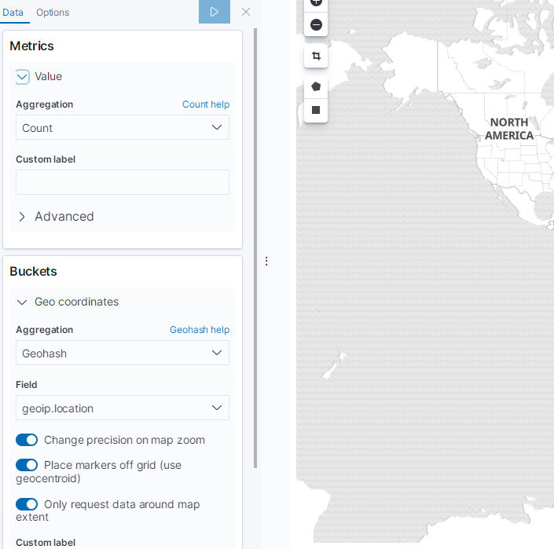

Title: Logstash Plugin -- logstash-filter-geoip
Status: published
Date: 2020-12-11 11:00
Modified: 2020-12-11 12:00
Category: Java
Tags: elasticsearch, logstash, geoip
Slug: logstash-filter-geoip
Authors: Martin
Summary: Logstash Plugin -- logstash-filter-geoip


## logstash-filter-geoip

logstash-filter-geoip 默认打包在 logstash 的安装包中

```
# 查看插件版本
bin/logstash-plugin list --verbose
```

作者的 logstash 7.5.1 目前使用的是这个插件的[最新版](https://www.elastic.co/guide/en/logstash-versioned-plugins/current/v6.0.3-plugins-filters-geoip.html)
```
logstash-filter-geoip (6.0.3)
```

[GeoLite2 下载地址](https://github.com/P3TERX/GeoLite.mmdb)

## 配置

在 logstash 的配置文件中增加一个 filter

```
filter {
    geoip {
        source => "ip"
        database => "C:\logstash-7.5.1\GeoLite2-City_20201210\GeoLite2-City.mmdb"
    }
```

只是这样是不够，还需要把索引 mapping 中的 类型修改一下，指定为 geo_point，最好是指定索引的 template 来修改数据类型

```
input {
    gelf {
        port => 12201
    }
}
filter {
    json {
        source => "message"
        remove_field => [ "server", "server.fqdn", "timestamp" ]
    }
    geoip {
        source => "ip"
        database => "C:\logstash-7.5.1\GeoLite2-City_20201210\GeoLite2-City.mmdb"
    }
}
output {
  stdout { codec => rubydebug }

if "_jsonparsefailure" not in [tags] {
  elasticsearch {
    hosts => ["192.168.100.1:9200"]
    index => "logstash-log-%{+YYYY}"
	template => "C:\logstash-7.5.1\logstash-log-template.json"
	template_name => "logstash-log"
	template_overwrite => true
    }
  }
}
```

```json
{
    "template" : "logstash-log",
	"index_patterns" : [
      "logstash-log-*"
    ],
	"mappings" : {
      "properties" : {
        "@timestamp" : {
          "type" : "date"
        },
        "@version" : {
          "type" : "text",
          "fields" : {
            "keyword" : {
              "type" : "keyword",
              "ignore_above" : 256
            }
          }
        },
        "browser" : {
          "type" : "text",
          "fields" : {
            "keyword" : {
              "type" : "keyword",
              "ignore_above" : 256
            }
          }
        },
        "browserMajorVersion" : {
          "type" : "text",
          "fields" : {
            "keyword" : {
              "type" : "keyword",
              "ignore_above" : 256
            }
          }
        },
        "browserType" : {
          "type" : "text",
          "fields" : {
            "keyword" : {
              "type" : "keyword",
              "ignore_above" : 256
            }
          }
        },
        "className" : {
          "type" : "text",
          "fields" : {
            "keyword" : {
              "type" : "keyword",
              "ignore_above" : 256
            }
          }
        },
        "deviceType" : {
          "type" : "text",
          "fields" : {
            "keyword" : {
              "type" : "keyword",
              "ignore_above" : 256
            }
          }
        },
        "facility" : {
          "type" : "text",
          "fields" : {
            "keyword" : {
              "type" : "keyword",
              "ignore_above" : 256
            }
          }
        },
        "geoip" : {
          "properties" : {
            "city_name" : {
              "type" : "text",
              "fields" : {
                "keyword" : {
                  "type" : "keyword",
                  "ignore_above" : 256
                }
              }
            },
            "continent_code" : {
              "type" : "text",
              "fields" : {
                "keyword" : {
                  "type" : "keyword",
                  "ignore_above" : 256
                }
              }
            },
            "country_code2" : {
              "type" : "text",
              "fields" : {
                "keyword" : {
                  "type" : "keyword",
                  "ignore_above" : 256
                }
              }
            },
            "country_code3" : {
              "type" : "text",
              "fields" : {
                "keyword" : {
                  "type" : "keyword",
                  "ignore_above" : 256
                }
              }
            },
            "country_name" : {
              "type" : "text",
              "fields" : {
                "keyword" : {
                  "type" : "keyword",
                  "ignore_above" : 256
                }
              }
            },
            "ip" : {
              "type" : "ip"
            },
            "latitude" : {
              "type" : "float"
            },
            "location" : {
			  "type": "geo_point",
			  "ignore_malformed": "true"
            },
            "longitude" : {
              "type" : "float"
            },
            "postal_code" : {
              "type" : "text",
              "fields" : {
                "keyword" : {
                  "type" : "keyword",
                  "ignore_above" : 256
                }
              }
            },
            "region_code" : {
              "type" : "text",
              "fields" : {
                "keyword" : {
                  "type" : "keyword",
                  "ignore_above" : 256
                }
              }
            },
            "region_name" : {
              "type" : "text",
              "fields" : {
                "keyword" : {
                  "type" : "keyword",
                  "ignore_above" : 256
                }
              }
            },
            "timezone" : {
              "type" : "text",
              "fields" : {
                "keyword" : {
                  "type" : "keyword",
                  "ignore_above" : 256
                }
              }
            }
          }
        },
        "host" : {
          "type" : "text",
          "fields" : {
            "keyword" : {
              "type" : "keyword",
              "ignore_above" : 256
            }
          }
        },
        "ip" : {
          "type" : "ip"
        },
        "level" : {
          "type" : "text",
          "fields" : {
            "keyword" : {
              "type" : "keyword",
              "ignore_above" : 256
            }
          }
        },
        "message" : {
          "type" : "text",
          "fields" : {
            "keyword" : {
              "type" : "keyword",
              "ignore_above" : 256
            }
          }
        },
        "platform" : {
          "type" : "text",
          "fields" : {
            "keyword" : {
              "type" : "keyword",
              "ignore_above" : 256
            }
          }
        },
        "platformVersion" : {
          "type" : "text",
          "fields" : {
            "keyword" : {
              "type" : "keyword",
              "ignore_above" : 256
            }
          }
        },
        "short_message" : {
          "type" : "text",
          "fields" : {
            "keyword" : {
              "type" : "keyword",
              "ignore_above" : 256
            }
          }
        },
        "simpleClassName" : {
          "type" : "text",
          "fields" : {
            "keyword" : {
              "type" : "keyword",
              "ignore_above" : 256
            }
          }
        },
        "source_host" : {
          "type" : "text",
          "fields" : {
            "keyword" : {
              "type" : "keyword",
              "ignore_above" : 256
            }
          }
        },
        "ua" : {
          "type" : "text",
          "fields" : {
            "keyword" : {
              "type" : "keyword",
              "ignore_above" : 256
            }
          }
        }
      }
    }
}
```

## Kibana Coordinate Map

配置完成之后就可以看到地图了，感觉还是很赞的




