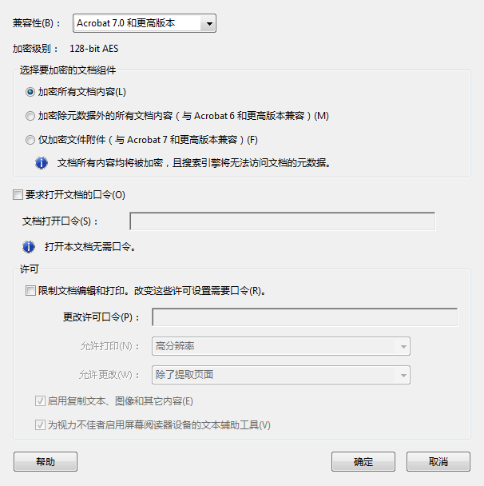
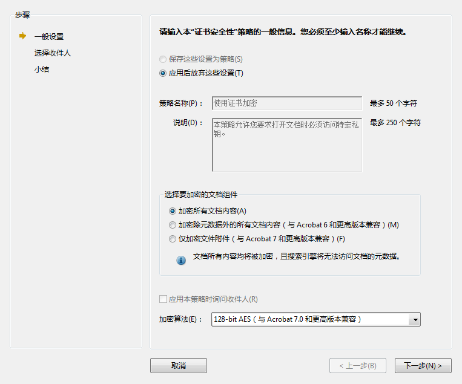
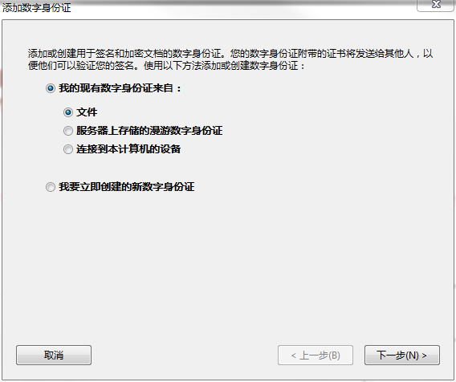

Title: PDF 版权保护
Status: published
Date: 2020-09-25 11:00
Modified: 2020-09-25 12:00
Category: Java
Tags: pdf
Slug: pdf-copyright
Authors: Martin
Summary: PDF 版权保护的思路

## PDF 版权保护

先说结论：PDF 作为一种开放的格式其实很难做到严格的版权保护。

### DRM (Digital rights management)

Adobe 官方提供 DRM 解决方案， 需要安装专用的软件，比如 Adobe Digital Editions，或者其他支持 Adobe Content Server 的软件，非常不方便。

而且有很多破解的方案，比如 Calibre DRM Removal Plugins

### 使用口令加密 或 使用证书加密

可以限制打印，内容复制，注释

不过这个很容易破解，网上有一大把方法

### 数字签名

数字签名只能防篡改，可以配合打水印一起，起到保护文档的作用。

签名的验证需要联网，在没有互联网的环境无法验证，参考 https://helpx.adobe.com/cn/acrobat/using/validating-digital-signatures.html

不过数字签名也很容易去掉，也有工具和代码。

### 打水印

打水印不用说了，是最常见的防盗版手段，一般都在页眉页脚添加。图灵社区就是这么多，随机在某些页的页脚添加。

不过既然是写程序打水印，那肯定是有规律的，怎么加上的水印就可以怎么写程序去掉。

### 最后的方法

目前没有太好的办法，只能选择多加几处水印，增加去除水印的难度，在发现PDF被盗版之后，及时跟换打水印的方法，并且在水印中增加渠道识别码，追踪从哪个渠道泄漏出去的，然后动用法律手段发律师函。

- 水印的位置和页码增加随机性
- 在 PDF MetaData 中增加字段和版权声明
- 在 PDF 中增加不可见的内容，比如没有引用到的obj，里面包含可追踪的数据

