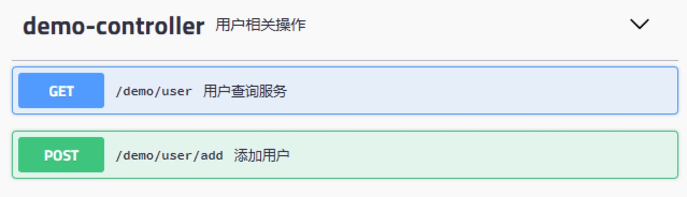

Title: spring 配置 swagger-ui
Status: published
Date: 2020-06-02 17:00
Modified: 2020-06-02 17:00
Category: Java
Tags: java, spring
Slug: spring-swagger-ui
Authors: Martin
Summary: spring 配置 swagger-ui


## swagger

Swagger UI 可以自动为我们生成一份交互式的接口文档，可以使用浏览器来查看并且操作 Rest API。非常方便接口的调试，也方便前后端人员的沟通。

### 配置 

如果是 spring-boot 项目，非常方便

1. 引入 maven dependency

```xml
<dependency>
    <groupId>io.springfox</groupId>
    <artifactId>springfox-swagger2</artifactId>
    <version>2.9.2</version>
</dependency>

<dependency>
    <groupId>io.springfox</groupId>
    <artifactId>springfox-swagger-ui</artifactId>
    <version>2.9.2</version>
</dependency>
```

2. Configuration

```java
/**
 * swagger2配置类
 */
@Configuration
@EnableSwagger2
public class SwaggerConfig {
    @Bean
    public Docket createRestApi() {
        return new Docket(DocumentationType.SWAGGER_2)
                .apiInfo(apiInfo())
                .select()
                .apis(RequestHandlerSelectors.basePackage("com.example"))
                .paths(PathSelectors.any())
                .build();
    }


    private ApiInfo apiInfo() {
        return new ApiInfoBuilder()
                .title("基于 Swagger 构建的 Rest API文档")
                .description("xxx")
                .contact(new Contact("xxx", "http://example.com", "xxx@example.com"))
                .termsOfServiceUrl("http://example.com")
                .version("1.0")
                .build();
    }
}
```

3. xml 配置

如果不是 spring-boot 项目，传统的项目也可以用 xml 来配置

除了上面的 SwaggerConfig 需要在 spring-mvc.xml 配置之外，还需要添加对 swagger-ui 中用到的静态文件的支持

```xml
        <bean id="swagger2Config"
              class="com.example.config.SwaggerConfig">
        </bean>

        <mvc:resources order="1" location="/resources/"
                       mapping="/resources/**" />
        <mvc:resources mapping="swagger-ui.html"
                       location="classpath:/META-INF/resources/" />
        <mvc:resources mapping="/webjars/**"
                       location="classpath:/META-INF/resources/webjars/" />


        <mvc:default-servlet-handler />
```


### Controller 的写法

```java
import io.swagger.annotations.Api;
import io.swagger.annotations.ApiOperation;
import io.swagger.annotations.ApiParam;
import org.slf4j.Logger;
import org.slf4j.LoggerFactory;
import org.springframework.beans.factory.annotation.Autowired;
import org.springframework.web.bind.annotation.*;

import java.util.HashMap;
import java.util.Map;

@RestController
@RequestMapping("/demo")
@Api(value = "demo接口", description = "用户相关操作")
public class DemoController {

    private static final Logger logger = LoggerFactory.getLogger(DemoController.class);

    @Autowired
    private DemoService demoService;

    @RequestMapping(value = "/user", method = RequestMethod.GET)
    @ApiOperation(value = "用户查询服务", notes = "根据传过来的userId来查询用户")
    public Map<String, Object> getUserById(@ApiParam(required = true, value = "用户id", example = "1000") @RequestParam String userId) {
        Map<String, Object> result = new HashMap<>();
        result.put("code", 0);

        logger.debug("GET /demo/user userId={}", userId);

        return result;
    }

    @RequestMapping(value = "/user/add", method = RequestMethod.POST)
    @ApiOperation(value = "添加用户", notes = "添加用户")
    public Map<String, Object> addUser(@ApiParam @RequestBody User user) {
        Map<String, Object> result = new HashMap<>();
        result.put("code", 0);

        logger.debug("POST /demo/user/add user={}", user);
        return result;
    }
}
```

配置好之后，打开 http://localhost:8080/your-app-root/swagger-ui.html 就可以看到文档


