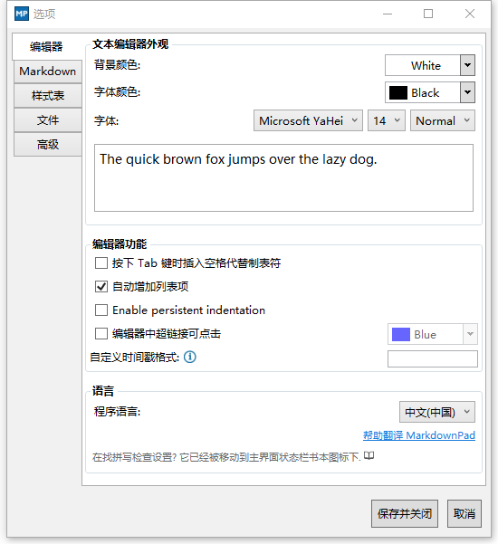
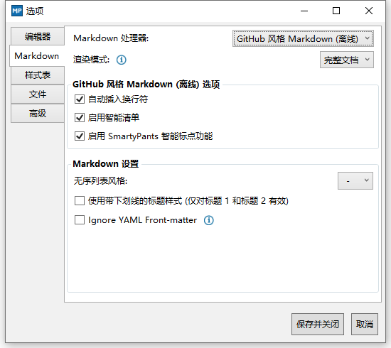

Title: Markdown 编辑器推荐
Status: published
Date: 2021-08-25 14:00
Modified: 2021-08-25 15:00
Category: Doc
Tags: markdown
Slug: markdown-editor-recommend
Authors: Martin
Summary: Markdown 编辑器推荐

## markdown pad 2

Win7 系统中，直接安装好MarkDownPad2就能直接运行，但在Win10系统中，会报“渲染错误 awesomium（ This view has crashed ）”的错误，为了解决这一问题，需要安装awesomium_v1.6.6_sdk_win.exe。参考[FAQ](https://markdownpad.com/faq.html#livepreview-directx)页面

markdownpad2-setup.exe [官网下载](http://markdownpad.com/download/markdownpad2-setup.exe)  

awesomium_v1.6.6_sdk_win.exe [官网下载](http://markdownpad.com/download/awesomium_v1.6.6_sdk_win.exe)  
    

注册邮箱：`Soar360@live.com`;  授权码：
`
GBPduHjWfJU1mZqcPM3BikjYKF6xKhlKIys3i1MU2eJHqWGImDHzWdD6xhMNLGVpbP2M5SN6bnxn2kSE8qHqNY5QaaRxmO3YSMHxlv2EYpjdwLcPwfeTG7kUdnhKE0vVy4RidP6Y2wZ0q74f47fzsZo45JE2hfQBFi2O9Jldjp1mW8HUpTtLA2a5/sQytXJUQl/QKO0jUQY4pa5CCx20sV1ClOTZtAGngSOJtIOFXK599sBr5aIEFyH0K7H4BoNMiiDMnxt1rD8Vb/ikJdhGMMQr0R4B+L3nWU97eaVPTRKfWGDE8/eAgKzpGwrQQoDh+nzX1xoVQ8NAuH+s4UcSeQ==
`

优化设置，可以设置`程序语言`和`markdown风格`

## IDEA 插件

IDEA [官方的插件](https://plugins.jetbrains.com/plugin/7793-markdown)支持 markdown，不过想要更多功能可以安装第三方插件

https://plugins.jetbrains.com/plugin/17254-markdown-editor

仅支持 2020.2 以后的版本

## vscode 插件

vscode markdown 的插件也很方便

安装插件 `Markdown All in One`, `Markdown Preview Enhanced`