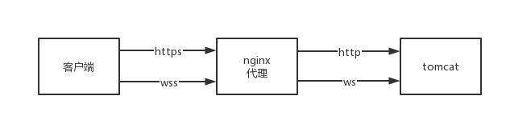

Title: Nginx WebSocket 代理配置
Status: published
Date: 2021-08-18 18:00
Modified: 2021-08-18 19:00
Category: Linux
Tags: nginx, websocket
Slug: nginx-websocket
Authors: Martin
Summary: Nginx WebSocket 代理配置


Tomcat 从 7.0.27开始支持 WebSocket，从 7.0.47 开始支持 JSR-356，如果前面有个 nginx 代理，nginx 也需要针对 websocket 做一下配置




在 http 段里定义两个变量

```
map $http_upgrade $connection_upgrade {
  default upgrade;
  '' close;
}
```

在 server proxy 里面添加

```
# websocket
proxy_http_version 1.1;
proxy_set_header Upgrade $http_upgrade;
proxy_set_header Connection $connection_upgrade;
```

nginx 里设置了 prxoy_read_timeout，所以导致 websocket 经过一段时间之后会就超时，所以要增加心跳检测，下面是简单的写法，也可以使用别人封装好的 js lib。

```javascript
// 60s 一次心跳
window.setInterval(function () {
    socket.send(JSON.stringify({
        type: "ping"
    }));
}, 60000);
```


