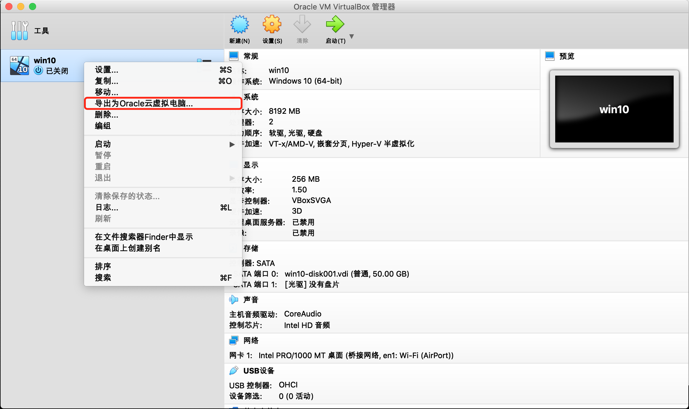
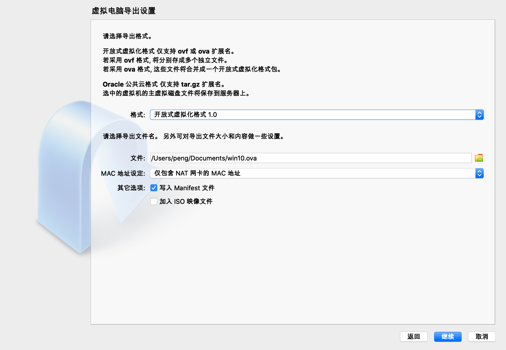
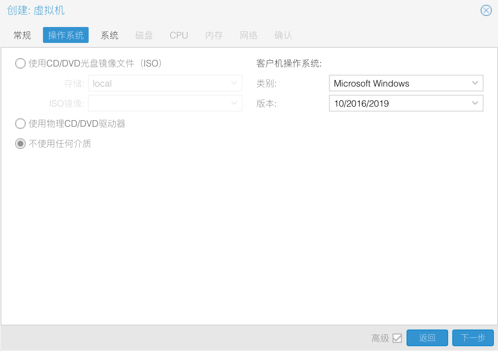
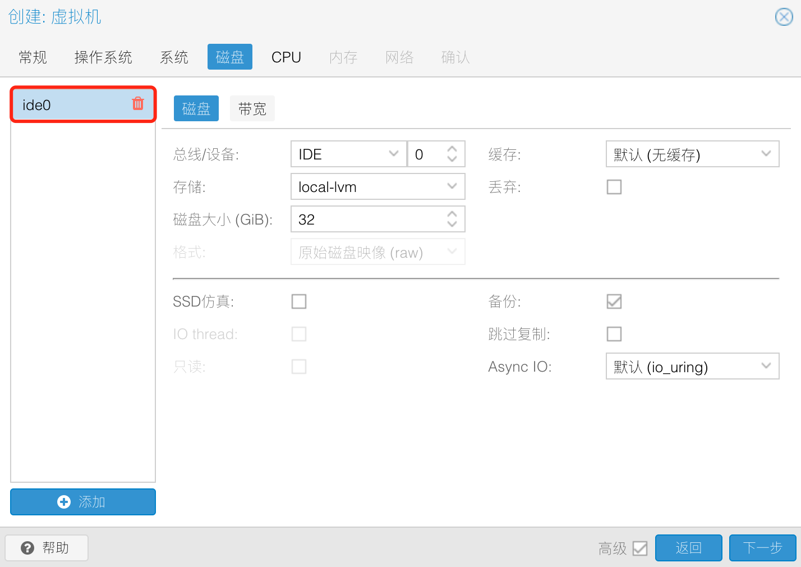
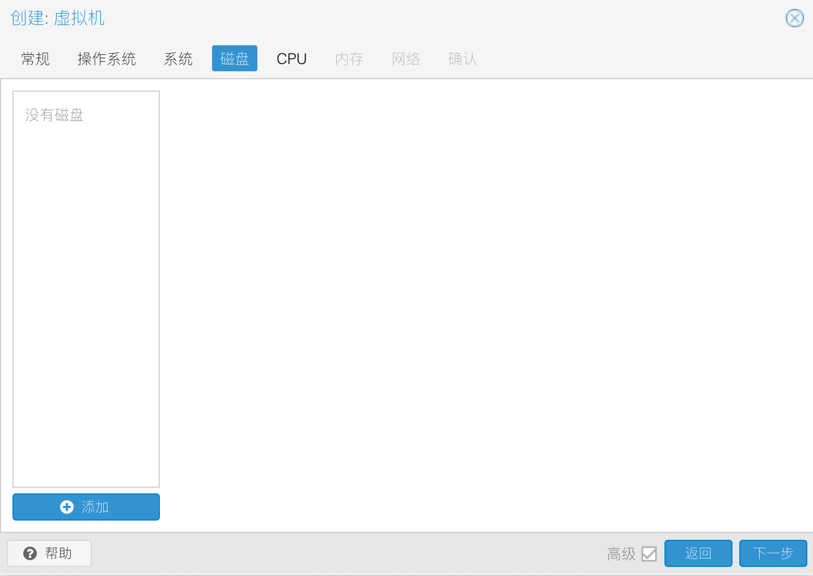
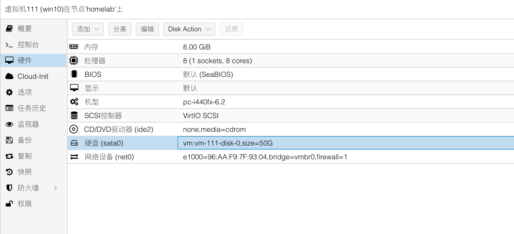

Title: Proxmox VE 导入 VirtualBox 中的虚拟机
Status: published
Date: 2022-10-08 23:00
Modified: 2022-10-08 23:00
Category: Linux
Tags: proxmox, virtualbox
Slug: proxmox-import-from-virtualbox
Authors: Martin
Summary: 如何把 VirtualBox 中的虚拟机导入 Proxmox VE 中

## Proxmox VE

Proxmox VE 是一个适合家用的免费的 KVM 虚拟机管理的 debian 发行版，大部分都可以通过网页操作，十分方便

之前用在本地用 VirtualBox 安装的虚拟机，想直接导入到 Proxmox VE 中，不想重新安装一编 Windows 10，还有很多软件。

在网上找了一下，有些帖子，但是没有完整的步骤，所以截图做了一个简单明了的步骤。

## VirtualBox 导出



默认选择`开放式虚拟化格式 1.0`就行，导出的文件是`win10.ova`



## Proxmox 导入

首先把文件上传到 Proxmox 主机的 /tmp 目录下

```shell
cd /tmp
tar -xvf win10.ova 
```

解压出来有三个文件：
- win10.mf 
- win10.ovf 
- win10-disk001.vmdk

最重要的就是`win10-disk001.vmdk`磁盘文件，接下来我们就要把这个文件导入到一个新建的虚拟机中

> 注意：新建虚拟机的时候删掉磁盘








导入磁盘，数字是之前新建虚拟的数字ID，后面那个`local-vm`是存储的名称，根据自己的需要修改命令

需要等一会，等进度条跑到 100% 就行了

```shell
qm importdisk 111 win10-disk001.vmdk local-vm -format qcow2
```

导入之后，就可以直接启动了

