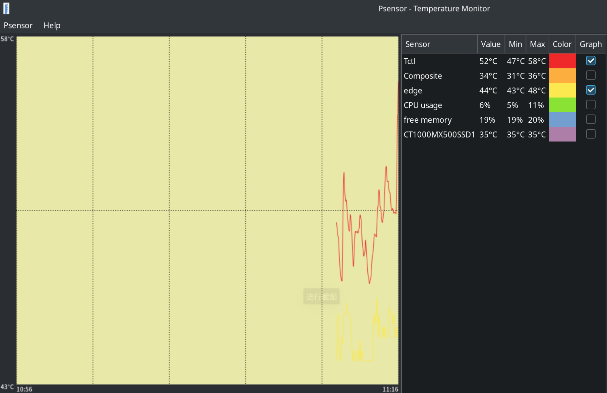

Title: 调整零刻 GTR5 5900HX 的风扇速度
Status: published
Date: 2024-09-15 22:00
Modified: 2024-09-15 22:00
Category: Hardware
Tags: hardware, fancontrol
Slug: beelink-GTR5-5900HX-fancontrol
Authors: Martin
Summary: 设置 BIOS 风扇控制

默认情况下零刻 GTR5 5900HX 的风扇转速设置的比较高，放在桌面上会比较吵，不过 BIOS 里可以设置风扇转速，可以让噪音减少

路径比较深

Advanced -> AMD CBS -> NBIO Common Options -> SMU Common Options -> Fan Control


为了把噪音降到最低，可以把功耗设置为 35w。


BIOS里的设置类似于上面的图

* Low Temperature
* Medium Temperature
* High Temperature
* Critical Temperature


* Low Pwm
* Medium Pwm
* High Pwm
* Critical Pwm，虽然没有选项，但是默认是 100

对应了上面图中的4个点，50°C/20% 转速， 70°C/40% 转速， 80°C/80% 转速，90°C/100% 转速，这样在温度比较低的时候转速比较低，就非常静音，默认是50°C/40% 转速， 70°C/60% 转速，就比较吵，所以需要调整，但是我好像没有看网上有关于零刻 GTR5 的 BIOS 设置，后面比较新的有类似的设置，不过在 BIOS 里的菜单跟 GTR5 的差别比较大。

Temperature Hysteresis 滞后，风扇滞变温度，也就是保存导致风扇转速变化的最后一个温度，如果温度下降，但下降的温度比这里设置的温度要低，风扇转速就不会变化。

在 debian 下可以安装 psensor 来查看温度，检查风扇温度控制设置的是否合理，既保证有效散热，又保证噪音低就比较合理。可以通过多次尝试来设置最适合自己的组合。

```bash
sudo apt install lm-sensors psensor
```



参考 
* [简单3步，温度直降14度！拯救零刻SER 5 Pro电脑散热问题 ](https://post.smzdm.com/p/a8x2n2mn/)
* [EQ12&EQ12Pro调整风扇转速教程](https://blog.csdn.net/u012514495/article/details/130546000)

