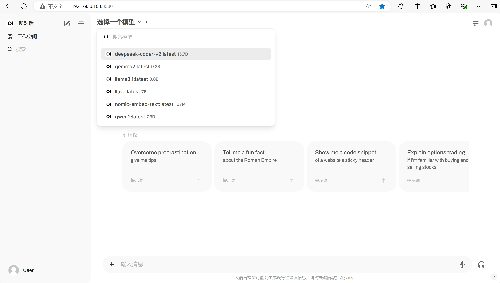

Title: 在 debian 12 体验大模型, Ollama 和 open-webui 安装
Status: published
Date: 2024-08-15 22:00
Modified: 2024-08-15 22:00
Category: Linux
Tags: debian, nvidia,
Slug: debian-llm-setup-ollama
Authors: Martin
Summary: 安装 Ollama 和 open-webui 的步骤

### 系统设置

在安装的时候选设置了 root 账号，但是需要把常用的账号加到sudoer列表里，使用起来更方便一点。root 作为特权账号，不适合日常使用。系统操作系统时的注意事项可以参考[上一篇](./debian-12-with-4060ti.md)

```
su - root
visudo
```

在 `root ALL=(ALL:ALL) ALL` 下面加一行 `xxx ALL=(ALL:ALL) ALL`


一般第一步就是跟换镜像源，让下载包的速度更快一点，这里选择腾讯云的镜像，虽然不在官方的镜像列表里，貌似速度快一点

```
deb https://mirrors.cloud.tencent.com/debian/ bookworm main contrib non-free non-free-firmware
deb-src https://mirrors.cloud.tencent.com/debian/ bookworm main contrib non-free non-free-firmware

deb https://mirrors.cloud.tencent.com/debian/ bookworm-updates main contrib non-free non-free-firmware
deb-src https://mirrors.cloud.tencent.com/debian/ bookworm-updates main contrib non-free non-free-firmware

deb https://mirrors.cloud.tencent.com/debian/ bookworm-backports main contrib non-free non-free-firmware
deb-src https://mirrors.cloud.tencent.com/debian/ bookworm-backports main contrib non-free non-free-firmware

deb https://security.debian.org/debian-security bookworm-security main contrib non-free non-free-firmware
deb-src https://security.debian.org/debian-security bookworm-security main contrib non-free non-free-firmware
```


### 安装 cuda 和 nvidia 驱动

下载 cuda toolkit, [https://developer.nvidia.com/cuda-downloads](https://developer.nvidia.com/cuda-downloads) 

这里使用 runfile 安装

```
# 先安装 gcc make linux-headers
sudo apt-get install gcc make linux-headers-$(uname -r)
wget https://developer.download.nvidia.com/compute/cuda/12.6.0/local_installers/cuda_12.6.0_560.28.03_linux.run
sudo sh cuda_12.6.0_560.28.03_linux.run
```

安装失败了，查看日志发现出现下面的错误

```
-> The file '/tmp/.X0-lock' exists and appears to contain the process ID '1680' of a running X server.
-> You appear to be running an X server.  Installing the NVIDIA driver while X is running is not recommended, as doing so may prevent the installer from detecting some potential installation problems, and it may not be possible to start new graphics applications after a new driver is installed.  If you choose to continue installation, it is highly recommended that you reboot your computer after installation to use the newly installed driver. (Answer: Abort installation)
```

停止 xorg 进程之后再重新安装 cuda 试试

```
ps -ef | grep xorg
# 看使用的是什么图形管理器，常见的有 gdm3/kdm/lightdm/sddm
sudo /etc/init.d/lightdm stop
```

出现了下面的输出说明安装成功了

```
===========
= Summary =
===========

Driver:   Installed
Toolkit:  Installed in /usr/local/cuda-12.6/

Please make sure that
 -   PATH includes /usr/local/cuda-12.6/bin
 -   LD_LIBRARY_PATH includes /usr/local/cuda-12.6/lib64, or, add /usr/local/cuda-12.6/lib64 to /etc/ld.so.conf and run ldconfig as root

To uninstall the CUDA Toolkit, run cuda-uninstaller in /usr/local/cuda-12.6/bin
To uninstall the NVIDIA Driver, run nvidia-uninstall
Logfile is /var/log/cuda-installer.log
```

`nvidia-smi` 输出下面的界面，说明找了显卡

```
+-----------------------------------------------------------------------------------------+
| NVIDIA-SMI 560.28.03              Driver Version: 560.28.03      CUDA Version: 12.6     |
|-----------------------------------------+------------------------+----------------------+
| GPU  Name                 Persistence-M | Bus-Id          Disp.A | Volatile Uncorr. ECC |
| Fan  Temp   Perf          Pwr:Usage/Cap |           Memory-Usage | GPU-Util  Compute M. |
|                                         |                        |               MIG M. |
|=========================================+========================+======================|
|   0  NVIDIA GeForce RTX 4060 Ti     Off |   00000000:26:00.0 Off |                  N/A |
| 30%   39C    P0             21W /  165W |       1MiB /  16380MiB |      0%      Default |
|                                         |                        |                  N/A |
+-----------------------------------------+------------------------+----------------------+

+-----------------------------------------------------------------------------------------+
| Processes:                                                                              |
|  GPU   GI   CI        PID   Type   Process name                              GPU Memory |
|        ID   ID                                                               Usage      |
|=========================================================================================|
|  No running processes found                                                             |
+-----------------------------------------------------------------------------------------+
```


### 安装 docker

[https://docs.docker.com/engine/install/debian/](https://docs.docker.com/engine/install/debian/) 参考官方的安装办法，这里使用 deb 包手动安装。

因为被墙了，所以需要一些上网魔法，`export https_proxy=http://example.com:8080`

```
wget https://download.docker.com/linux/debian/dists/bookworm/pool/stable/amd64/containerd.io_1.7.20-1_amd64.deb
wget https://download.docker.com/linux/debian/dists/bookworm/pool/stable/amd64/docker-ce_27.1.2-1~debian.12~bookworm_amd64.deb
wget https://download.docker.com/linux/debian/dists/bookworm/pool/stable/amd64/docker-ce-cli_27.1.2-1~debian.12~bookworm_amd64.deb
wget https://download.docker.com/linux/debian/dists/bookworm/pool/stable/amd64/docker-buildx-plugin_0.16.2-1~debian.12~bookworm_amd64.deb
wget https://download.docker.com/linux/debian/dists/bookworm/pool/stable/amd64/docker-compose-plugin_2.29.1-1~debian.12~bookworm_amd64.deb
```

安装下载的 deb 包
```
sudo dpkg -i *.deb
```

可能会出现缺少依赖的问题

```
Setting up docker-buildx-plugin (0.16.2-1~debian.12~bookworm) ...
dpkg: dependency problems prevent configuration of docker-ce:
 docker-ce depends on iptables; however:
  Package iptables is not installed.

dpkg: error processing package docker-ce (--install):
```

执行下面的方法修复，会安装 iptables libip6tc2，然后再 dpkg 重新安装一下

```
sudo apt --fix-broken
```

验证一下，需要配置一下 docker 镜像来加速，可以用赛博菩萨 cloudflare.com 的服务免费搭一个 docker 镜像，网上有很多教程


```
sudo vi /etc/docker/daemon.json
```

```
{
    "registry-mirrors": [
        "http://docker.自己去搭.cn"
    ]

}
```

拉取 hello-world 镜像验证一下是否成功

```
$ sudo docker run hello-world
Unable to find image 'hello-world:latest' locally
latest: Pulling from library/hello-world
c1ec31eb5944: Pull complete
Digest: sha256:53cc4d415d839c98be39331c948609b659ed725170ad2ca8eb36951288f81b75
Status: Downloaded newer image for hello-world:latest

Hello from Docker!
This message shows that your installation appears to be working correctly.

To generate this message, Docker took the following steps:
 1. The Docker client contacted the Docker daemon.
 2. The Docker daemon pulled the "hello-world" image from the Docker Hub.
    (amd64)
 3. The Docker daemon created a new container from that image which runs the
    executable that produces the output you are currently reading.
 4. The Docker daemon streamed that output to the Docker client, which sent it
    to your terminal.

To try something more ambitious, you can run an Ubuntu container with:
 $ docker run -it ubuntu bash

Share images, automate workflows, and more with a free Docker ID:
 https://hub.docker.com/

For more examples and ideas, visit:
 https://docs.docker.com/get-started/
```

下面的命令让用户不使用 sudo 也可以操作 docker，使用起来更方便

```
sudo usermod -aG docker $USER
newgrp docker
```

#### 安装 NVIDIA Container Toolkit

[NVIDIA Container Toolkit](https://docs.nvidia.com/datacenter/cloud-native/container-toolkit/latest/install-guide.html) 

下载 deb 的地址 [https://github.com/NVIDIA/nvidia-container-toolkit/releases](https://github.com/NVIDIA/nvidia-container-toolkit/releases)

```
tar -zxvf nvidia-container-toolkit_1.16.1_deb_amd64.tar.gz
cd release-v1.16.1-stable/packages/ubuntu18.04 
sudo dpkg -i *.deb
sudo nvidia-ctk runtime configure --runtime=docker
sudo systemctl restart docker
```

安装完成之后，在 docker 中运行的程序也可以使用 GPU

### Installing Ollama

去官网下载 [https://ollama.com/](https://ollama.com/)

```
curl -fsSL https://ollama.com/install.sh | sh
```

推荐试试这几个模型，这也是 continue.dev 这个 AI 编程插件推荐的

```
ollama run llama3.1:8b
ollama run deepseek-coder-v2:16b
ollama pull nomic-embed-text
```

### Install open-webui

可以使用docker

```
sudo docker pull ghcr.io/open-webui/open-webui:cuda
```

也可以直接安装 `pip install open-webui`，后者的可控性更强一点

```
python3 -m venv open_webui_venv
pip install open-webui
```

依赖的包很多，等待下载完需要一段时间

一个人可以不开启用户管理，直接是一个对话界面，下面是启动脚本

```
# start.sh
source ~/open_webui_venv/bin/activate
export WEBUI_AUTH=False
export HF_ENDPOINT=https://hf-mirror.com
nohup open-webui serve &
```

最后打开的界面如下，非常简洁

