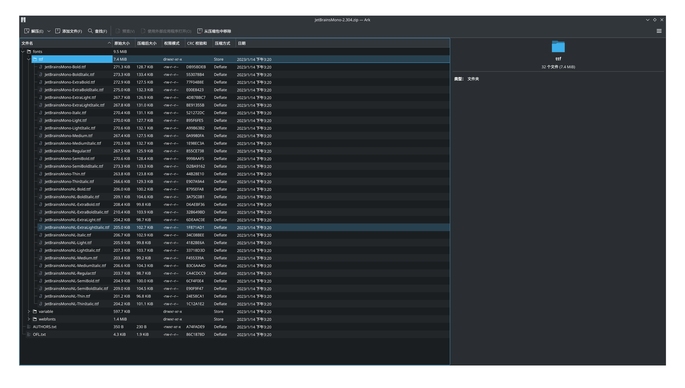
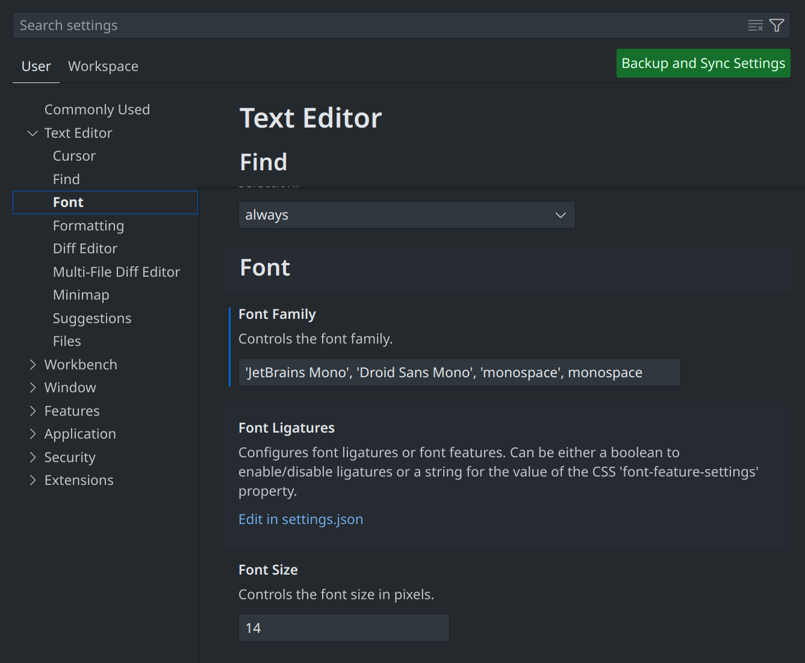

Title: 设置 vscode 的字体
Status: published
Date: 2024-09-07 22:00
Modified: 2024-09-07 22:00
Category: Linux
Tags: debian, vscode
Slug: debian-12-vscode-font
Authors: Martin
Summary: 设置 vscode 的字体

在 Debian 12 KDE Plasma 默认中文的环境下，vscode 的英文字体是 Droid Sans Mono，不适合写代码，我们可以替换成 Jetbrains 出的 JetBrains Mono 字体，看起来效果就会好很多。Terminal 的字体也会替换过来。

先去 JetBrains 官网下载字体 [https://www.jetbrains.com/lp/mono/](https://www.jetbrains.com/lp/mono/)




把 ttf 文件夹下的字体 复制到 /usr/share/fonts/JetBrains-Mono，然后刷新字体缓存

```bash
# 有可能要修改字体文件的权限
sudo chmod -R 644 /usr/share/fonts/JetBrains-Mono/*
fc-cache -f -v
# 检查字体是否安装成功
fc-list | grep JetBrains
```

还有一种安装方式是使用 debian 源里面的 fonts-jetbrains-mono

```
sudo apt install fonts-jetbrains-mono
```

设置 vscode -> Settings -> Text Editor -> Font -> Font Famliy ，把 'Jetbrains Mono' 加到字体的最前面该上去



对应 settings.json 中会设置如下


```
"editor.fontFamily": "'JetBrains Mono', 'Droid Sans Mono', 'monospace', monospace",
"editor.fontLigatures": false // 是否启用字体连字
```

参考 [https://msdemt.github.io/p/ubuntu-vscode-font/](https://msdemt.github.io/p/ubuntu-vscode-font/)