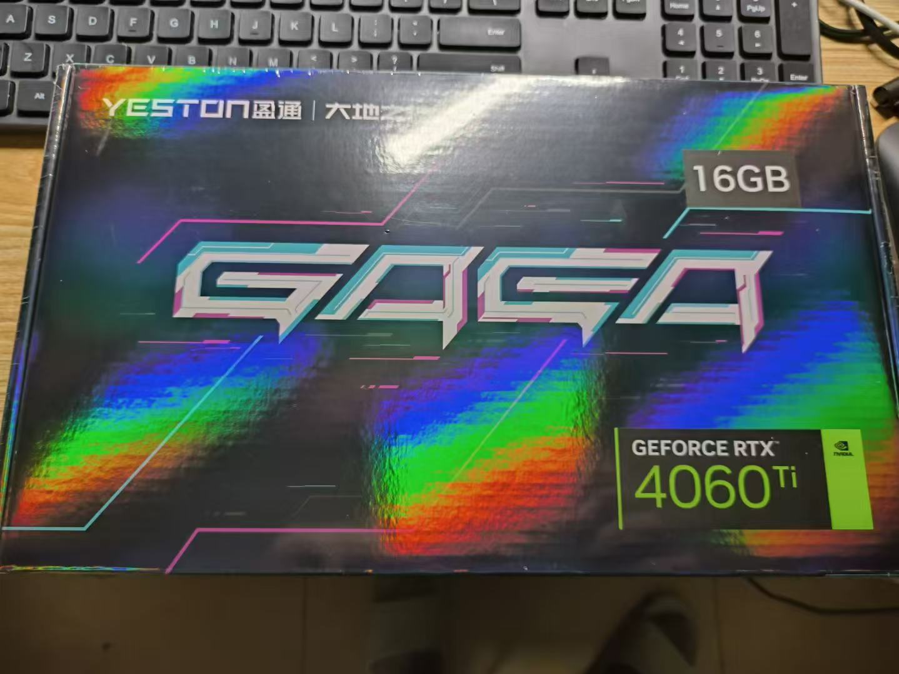

Title: 在显卡为 Nvidia RTX 4060ti 的台式机上安装 debian 12
Status: published
Date: 2024-08-14 22:00
Modified: 2024-08-14 22:00
Category: Linux
Tags: debian, nvidia, 4060
Slug: debian-12-with-4060ti
Authors: Martin
Summary: 不要选 KDE Plasma/Wayland 桌面环境

最近想尝试一下大模型，所以买了一张 Nvidia RTX 4060ti 16G 显卡

在淘宝上购买的，3299元，因为机箱放不下三风扇的长显卡，所以买了个两风扇的，而且不用放显卡支架，给我的电脑升级一下哈。

第一件事就是重新系统，因为之前是 AMD RX580的显卡，应该是需要重装，此处存疑？为了一个干净的系统从头开始，硬盘里也没啥重要资料，都是些下载的电影，所以选择了重装。

习惯了 KDE 桌面环境，所以安装的时候选择了 KDE Plasma 桌面环境，但是安装完成之后重启，无法进入桌面，启动过程卡在了 CUPS Scheduler，和[这个帖子](https://forums.debian.net/viewtopic.php?t=155493)的现象相同。

看了帖子的内容之后和网上摸索，发现是 KDE Plasma 用了 Wayland，而 N 卡的 Wayland 支持并不好，所以会出现启动卡住的问题。

解决这个问题可以在启动界面按 Ctrl+Shift+F3，进入 console，安装 Nvidia 的官方驱动，网上有详细的教程。

另一个解决方法是安装别的桌面环境，这次我选择了 xfce，安装成功后就直接进入桌面了，不会卡启动过程了。

在网上看到的资料不多，只有 debian 的论坛里有英文的帖子，写来下希望更多的人看到哈。