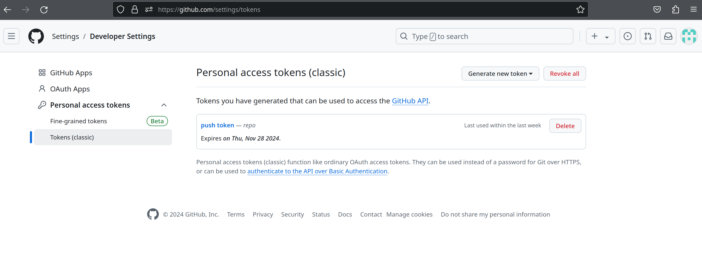
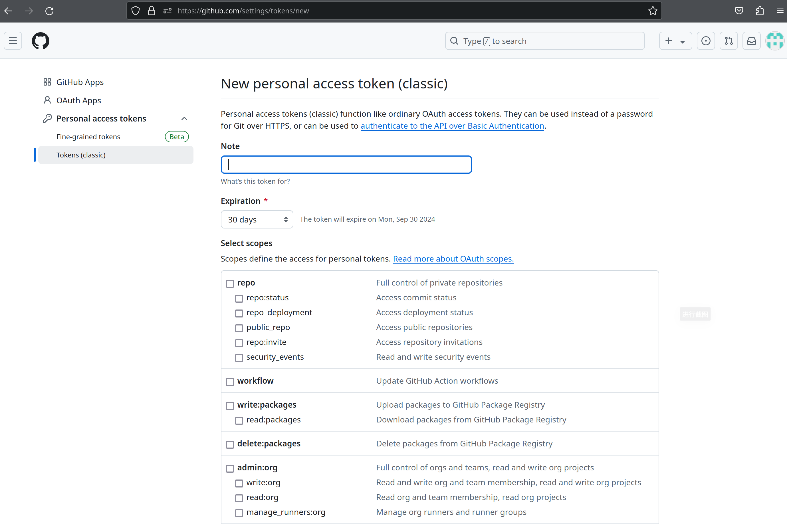

Title: github push in 2024
Status: published
Date: 2024-08-31 12:00
Modified: 2024-08-31 12:00
Category: Linux
Tags: github, git
Slug: github-push-in-2024
Authors: Martin
Summary: 在2024年应该如何往 github 上 push 代码


github 推送代码的时候不支持使用密码了，需要使用一个token，setttings ->  Developer Settings -> Personal access tokens




Generate new token 新建一个 token ，最好设置一个有效期，把 repo 相关的权限都勾上



然后在 git push 的时候，用户名是原来的用户名，密码输入这个 token 就可以了

有时候会出现github 无法连上的情况，可以加上魔法

```
# 加上
git config --global http.https://github.com.proxy http://127.0.0.1:7890
# 去掉
git config --global --unset http.https://github.com.proxy
```


