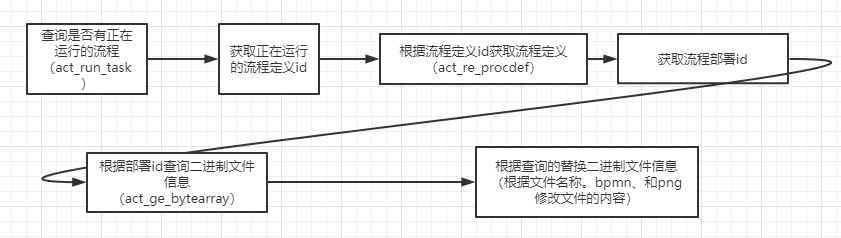

Title: 如何修改 flowable 流程图重新发布后对正在运行的流程生效
Status: published
Date: 2024-04-06 18:00
Modified: 2024-04-06 18:00
Category: Java
Tags: java, flowable
Slug: how-to-modify-flowable-active-process-instance
Authors: Martin
Summary: 修改数据库然后重启

## 修改 flowable 流程图

如果 flowable 流程有变化，部署新流程之后如何让已经启动的旧的流程更换成新的流程图

首先，流程图应该在上次的基础上修改，节点的ID至少不能变化，可以增加节点，减少的节点只要已有的流程实例不处于那个节点就行。

然后部署流程，会得到新的流程定义

## 修改数据库

流程引擎中是根据 act_ge_bytearray 中存储的 BPMN 二进制信息知道流程的走向的，所以，实现思路就是拿新的 BPMN 二进制文件替换旧的 BPMN 文件即可实现新的流程应用到新的流程中。




```sql
select * from act_run_task where ID_ = ?; -- 找到 proc_def_id
select * from act_re_procdf where PROC_DEF_ID_ = ?;  -- 找到 deployment_id
select * from act_ge_bytearray where DEPLOYMENT_ID_ = ?; -- 找到流程定义 bpmn.xml
```

## 缓存失效或者重启

因为flowable 有缓存，在数据库中替换了 xml 之后，还需要清楚缓存才能生效，旧的流程实例才能使用新的流程定义

最简单的方法，`重启`即可

也有用编程的方法实现清除缓存的，这个功能是需要提前做好的，而不是临时处理线上流程。

```java
DeploymentManager deploymentManager = configuration.getDeploymentManager();
deploymentManager.getBpmnModelCache().remove(definition.getId());
deploymentManager.getProcessDefinitionCache().remove(definition.getId());
```

参考
1. [https://dou-chi.gitee.io/actdynamicprocess/](https://dou-chi.gitee.io/actdynamicprocess/)
2. [https://blog.csdn.net/u014596024/article/details/112937832](https://blog.csdn.net/u014596024/article/details/112937832)