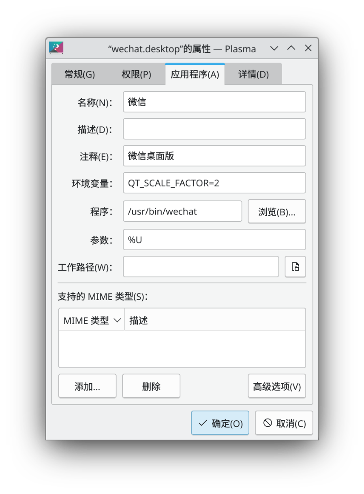

Title: 在 debian 12 安装微信
Status: published
Date: 2024-08-29 22:00
Modified: 2024-08-29 22:00
Category: Linux
Tags: debian, wechat
Slug: install-wechat-on-debian-12
Authors: Martin
Summary: 在 debian 12 上安装微信

之前在 linux 上用微信只能用 deepin 打包的基于 wine 的微信，经常会异常推出，使用起来也不流畅，但是现在微信在linux 上有原生版本了


[https://github.com/lovechoudoufu/wechat_for_linux](https://github.com/lovechoudoufu/wechat_for_linux)

下载最新版，直接安装 deb 包，但是安装之后，点击图标之后闪退，没打开登陆窗口。

这时候可以直接在命令行输入`wechat`，看看有什么报错信息，我的情况提示下面的错误

```
error while loading shared libraries: libatomic.so.1: cannot open shared object file: No such file or directory
```

马上安装对应的包

```
sudo apt-get install libatomic1
```

然后就可以登陆，但是窗口有点小，因为我的屏幕是4K屏幕，KDE Plasma 桌面缩放设置成了 200% ，这个微信使用 QT 开发的，所以需要设置一下环境变量，让微信的也显示成 200%



如果用命令行启动的话，在命令行 `export QT_SCALE_FACTOR=2`

这样使用起来就比较完美了，支持通讯录，搜一搜，视频号，小程序


看来这个包看起来是给 kylin 开发的，所以打的包里有 `/etc/lsb-release`

```
DISTRIB_ID=Kylin
DISTRIB_RELEASE=V10
DISTRIB_CODENAME=kylin
DISTRIB_DESCRIPTION="Kylin V10 SP1"
DISTRIB_KYLIN_RELEASE=V10
DISTRIB_VERSION_TYPE=enterprise
DISTRIB_VERSION_MODE=normal
```

还有一些其他配置信息，伪装成国产操作系统，更多信息可以查看下面的连接

1. [https://www.52pojie.cn/thread-1896902-1-1.html](https://www.52pojie.cn/thread-1896902-1-1.html)
2. [https://github.com/7Ji-PKGBUILDs/wechat-universal-bwrap](https://github.com/7Ji-PKGBUILDs/wechat-universal-bwrap)
3. [https://aur.archlinux.org/packages/wechat-universal-bwrap](https://aur.archlinux.org/packages/wechat-universal-bwrap)