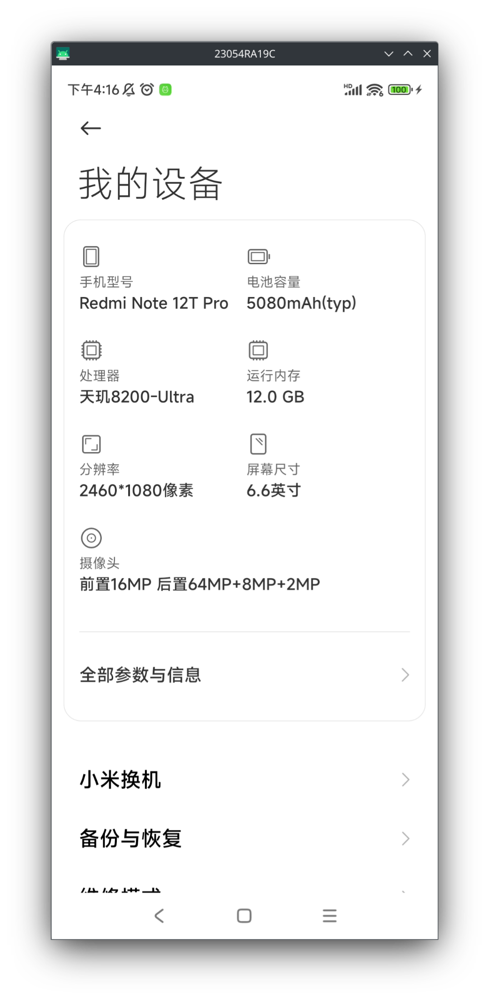
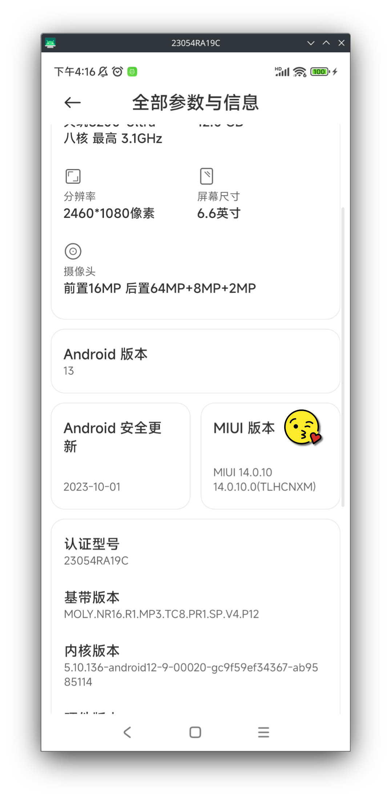
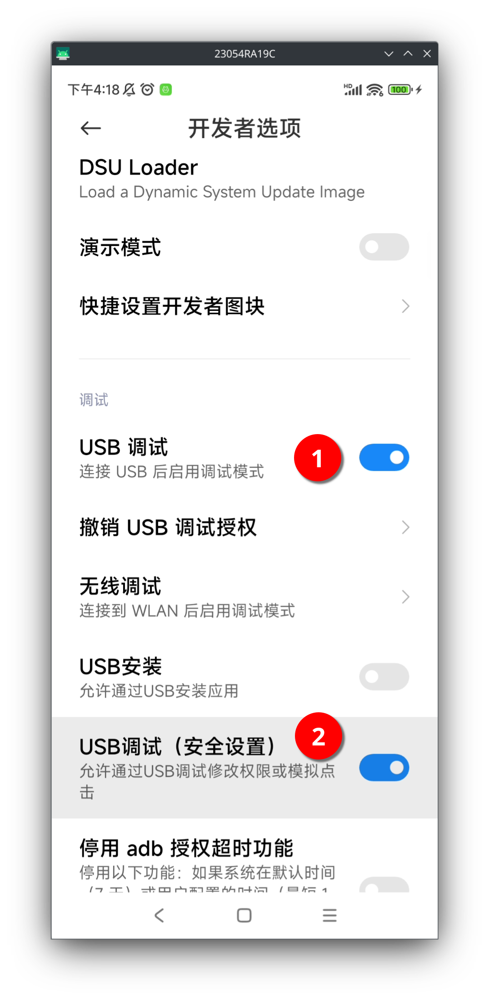

Title: 使用 scrcpy 在电脑上镜像手机
Status: published
Date: 2024-11-03 22:00
Modified: 2024-11-03 22:00
Category: Linux
Tags: linux, android
Slug: scrcpy-mirror
Authors: Martin
Summary: scrcpy 的用法

属手机是一个巨大的消耗时间的黑洞，为了避免这种情况，所以尽量用电脑来操作和获取信息。但是手机又不能不用，有很多东西电脑上无法替代。有一个很好的工具`scrcpy`可以在电脑上镜像手机，控制手机，开源而且免费的。

[https://github.com/Genymobile/scrcpy](https://github.com/Genymobile/scrcpy)

先安装依赖

```bash
sudo apt install ffmpeg libsdl2-2.0-0 adb wget \
                 gcc git pkg-config meson ninja-build libsdl2-dev \
                 libavcodec-dev libavdevice-dev libavformat-dev libavutil-dev \
                 libswresample-dev libusb-1.0-0 libusb-10-0-dev
```

安装 scrcpy

```bash
cd scrcpy
./install_release.sh
```

手机需要开调试模式，用USB线连上电脑，用下面的命令就可以打开一个手机的窗口，更多选项可以参考官方文档

```bash
scrcpy --video-codec=h265 --max-size=1920 --max-fps=60 --no-audio --keyboard=uhid --turn-screen-off --stay-awake 
```

有些情况不能镜像，比如支付的时候输入密码，国产的 android 系统都会黑屏来保护用户的输入。

一些快捷键

| 作用      | 快捷键 |
|----------|----------|
| Home 键  | Alt + h |
| 返回键    | Alt + b 或者鼠标右键单击 |
| 近期任务  | Alt + s |
| 展开通知栏 | Alt + n |
| 收起通知栏 | Alt + Shitf + n |
| 菜单键    | Alt + m |
| 音量键 +  | Alt + ↑ |
| 音量键 -  | Alt + ↓ |
| 电源键    | Alt + p |
| 熄屏但是继续投屏 | Alt + o |
| 点亮屏幕  | 鼠标右键单击 |
| 传文件到手机 |将文件拖入显示窗口 |
| 粘贴电脑上的文字 | Ctrl + v |


## 小米手机打开调试模式

小米手机打开调试模式稍微有点困难

设置 -> 我的设备 -> 全部参数与信息



多次点击【MIUI版本】（大概是6次左右），就会在【更多设置】中打开开发者选项



在开发者选项中，打开调试模式，有两个地方要打开

