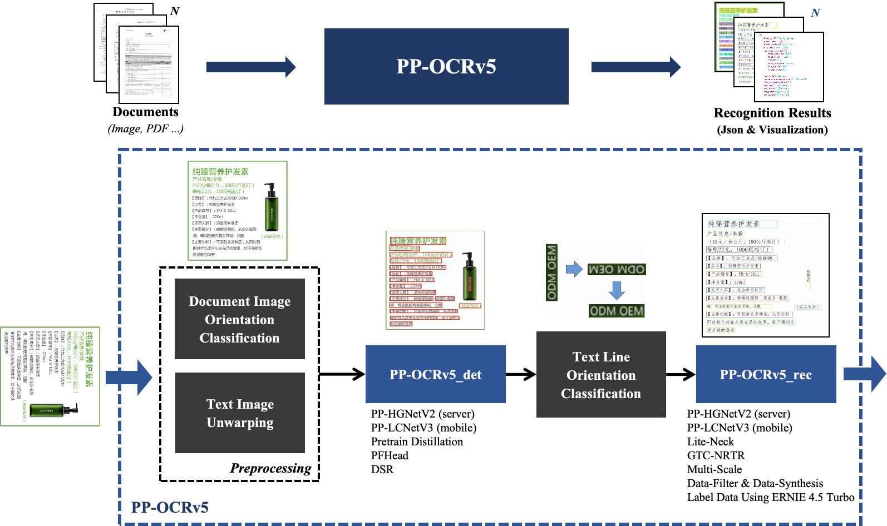
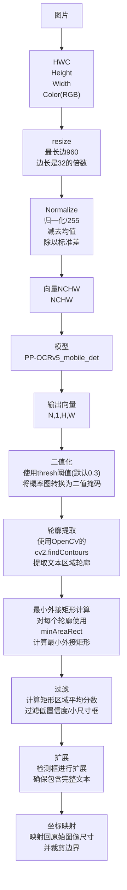
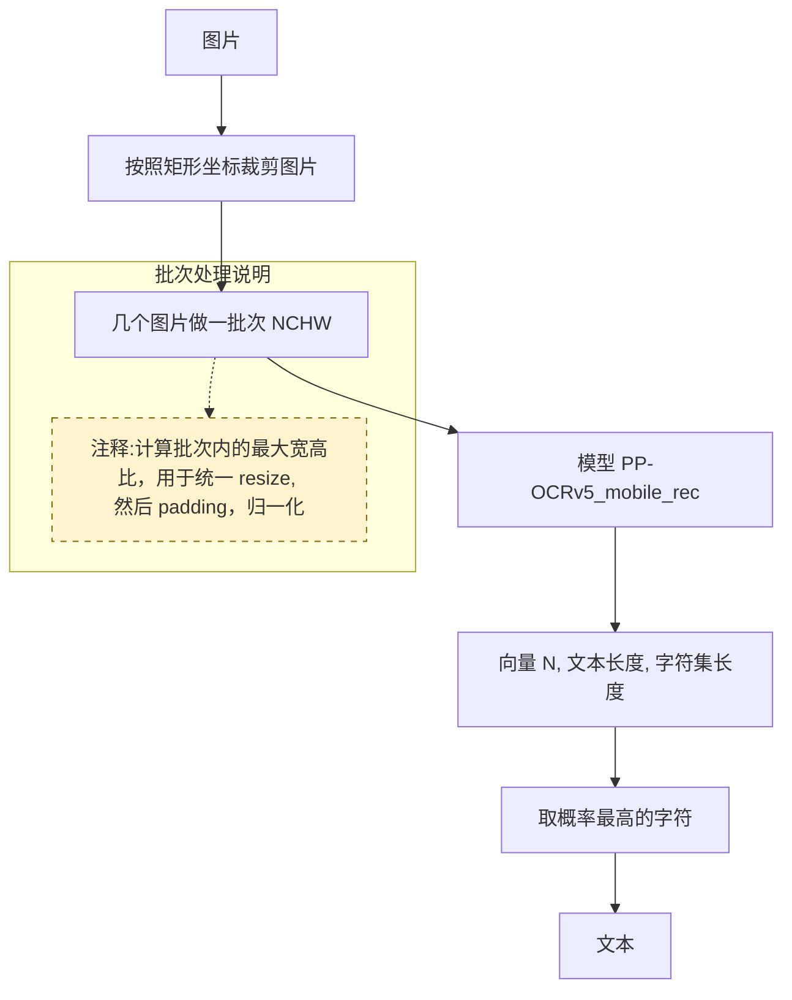
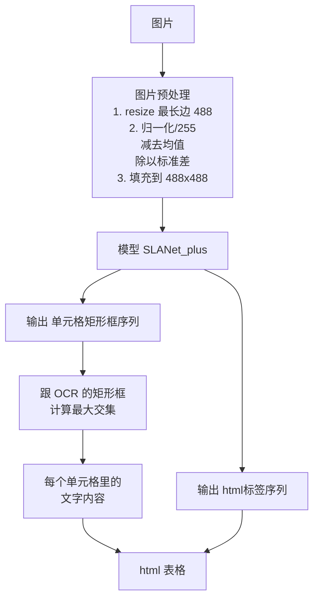

Title: paddle OCR 的文字识别过程
Status: published
Date: 2025-10-05 20:00
Modified: 2025-10-05 20:00
Category: AI
Tags: ai, ocr
Slug: paddle-ocr-process
Authors: Martin
Summary: paddle OCR 的文字识别过程

PaddleOCR 是百度开源的一个非常优秀的 OCR 模型 + pipeline，基于百度自己的 paddlepaddle 框架，虽然文档写得让人非常难以上手，而且都是基于百度自己的框架实现的。

下面以最常见的一个普通的 OCR 过程为例子，参考 RapidOCR 的代码，解读一下 OCR 的过程，虽然跟现在流行的大模型差别比较大，但是基本原理应该是一样的。

下面使用 [PP-OCRv5](https://www.paddleocr.ai/main/version3.x/algorithm/PP-OCRv5/PP-OCRv5_multi_languages.html) 的模型。

paddlepaddle 的模型可以转换成 onnx 模型，然后通过 onnxruntime 来运行，虽然用的 lib 不一样，但是原理是一样的

如图，有两个可选的逻辑
1. 文档方向分类模型，含有四个类别，即0度，90度，180度，270度
2. 文本图像校正模型，针对倾斜的图像，把文本旋转到正确的角度

## 文本检测模块

输入是一个图片，需要向量化

输出的也是向量，可以转换成 BBOX 四个点

## 文本识别模块

先用上面的 BBOX，把图片切分成一小块一小块，然后再针对每张或者一个批次，进行识别

输出是向量，能对应到词表的某个词

## 表格识别模块

SLANet_plus 表格识别模型，识别出单元格，然后跟 OCR 识别的坐标信息结合起来就可以实现表格识别，最后结果为 html 表格

