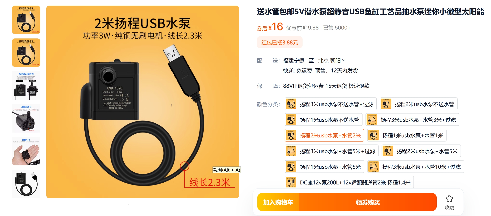
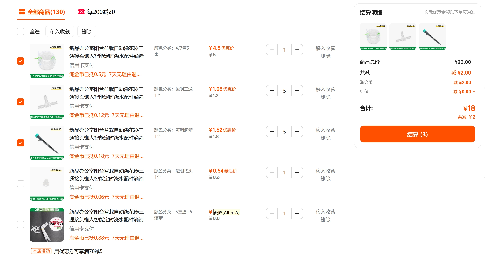
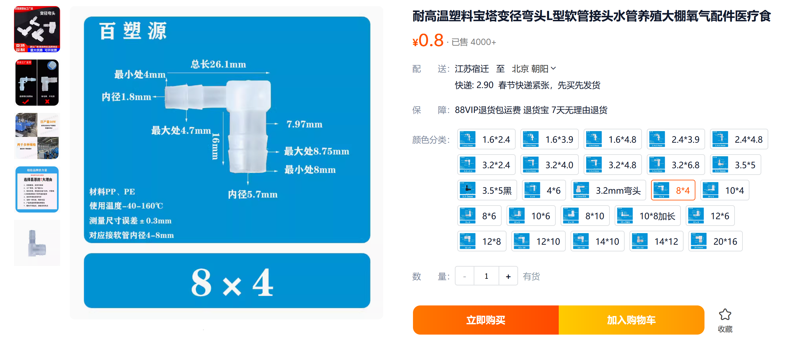
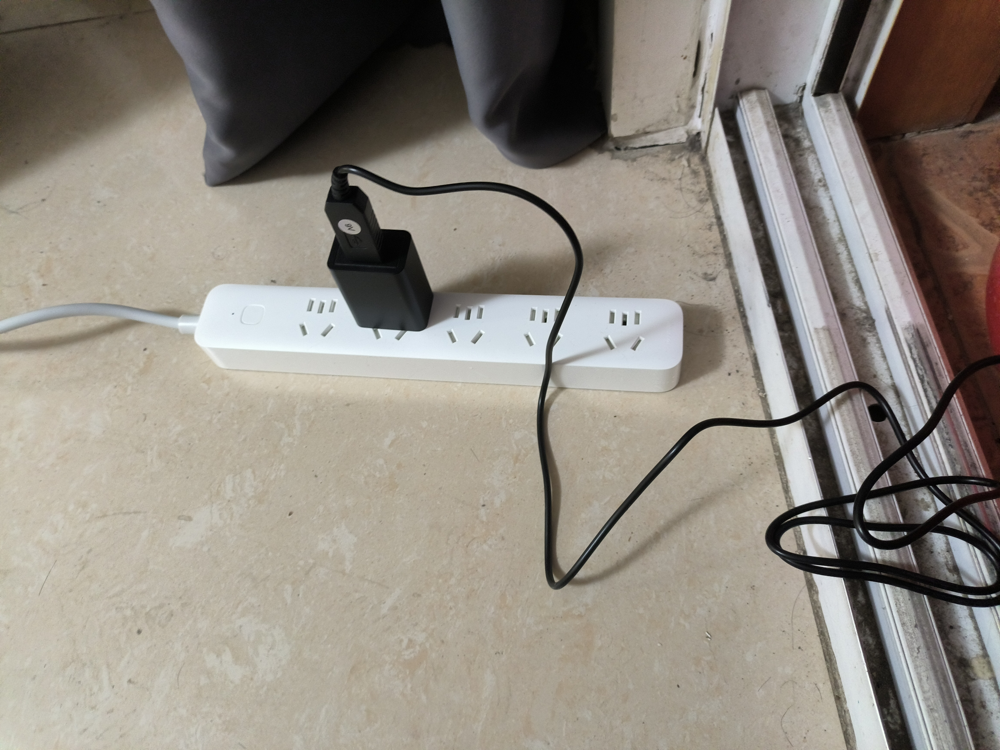
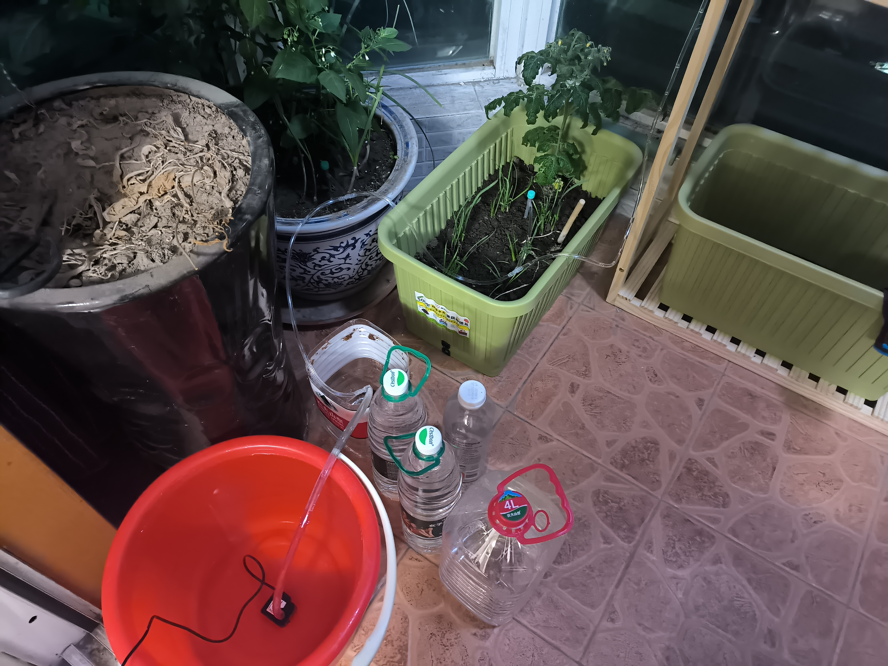
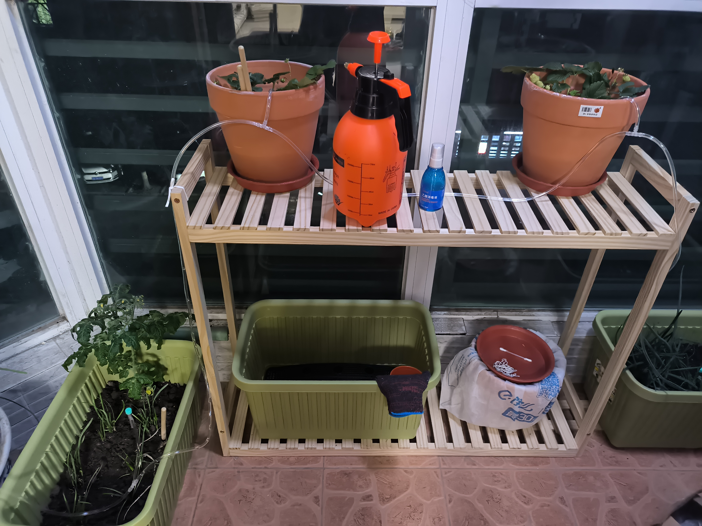

Title: 低成本打造一个阳台自动灌溉系统
Status: published
Date: 2025-02-01 23:00
Modified: 2025-02-02 10:00
Category: Hardware
Tags: watering, automation
Slug: watering-automation-with-low-cost
Authors: Martin
Summary: 万能的淘宝啥都要卖的，自己动手组装一下就可以了

春节假期要回家十多天，担心阳台的菜没人浇水会挂掉，打算搞一套自动浇水的，首先是上淘宝搜索相关的商品，价格比较贵，虽然看起来很漂亮，但是我只是临时用一下，不打算长期使用。

后面打算自己DIY一套自动浇水的设备，首先是需要一个水泵，作为输送水的动力源，网上有帖子推荐用385水泵，这是一个直流水泵，还单独需要一个交流转直流的电源, 水泵的输入电压 12V。很多茶吧上水的水泵就是这个，大部分作为配件来卖，卖一整套电源+水泵的不多。后面想到有没有USB接口 5V 的水泵卖，搜了一下还真有，养鱼的潜水泵很多都这种。水泵有个指标是扬程。扬程就是水泵抽水可以抽多高，根据自己家里的情况，花架的高度选择合适扬程的水泵，一般扬程越高的水泵功率越高，价格也越贵。

最后选择了这款，2m扬程的，USB 供电的，可以利用旧手机的 USB 充电头

灌溉可以使用滴箭来控制水流的大小，建议使用可调节的滴箭，因为如果有花架的话，不同高度的水压大小不一样，可能导致不同的地方浇水不均匀。

有一个细节需要注意，水泵水管的直径，一般都是 8mm，但是灌溉用的水管都是 4mm，需要买个转接头

再加上一个小米智能插线板，作为定时开关，这个因为已经有了，不算成本。水泵，水管加起来总成本在40元左右，还行，如果在淘宝再仔细翻一翻应该能找到更便宜的。

最后组装起来，调节一下滴箭的流速，不要过快也不要过慢，每一盆的流速都差不多。

最后看一下组装起来的效果

